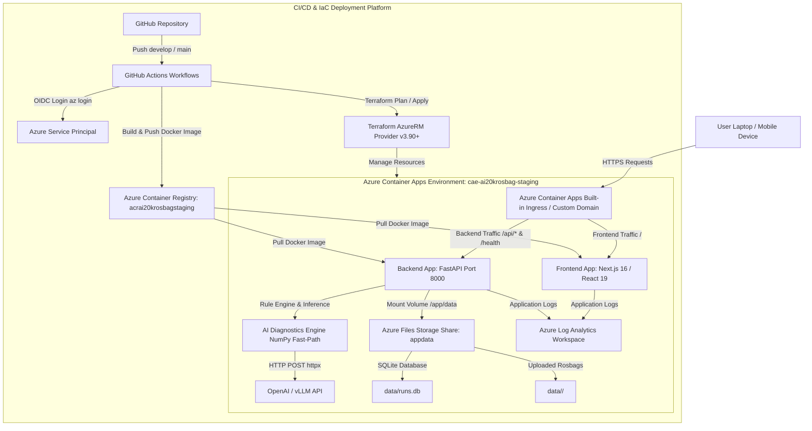

# 📘 Azure Complete Guide — RAV-13 Rosbag Diagnostics Platform

Tài liệu tổng hợp toàn bộ hướng dẫn triển khai, thiết lập và xử lý sự cố Azure cho dự án **RAV-13 Rosbag Diagnostics Platform**.

---

## 📋 Mục Lục

1. [Hướng Dẫn Triển Khai Lên Azure](#1-hướng-dẫn-triển-khai-lên-azure)
2. [Azure App Registration & GitHub Secrets Setup](#2-azure-app-registration--github-secrets-setup)
3. [Checklist Triển Khai Lần Đầu](#3-checklist-triển-khai-lần-đầu)
4. [Azure & GitHub Permission Troubleshooting](#4-azure--github-permission-troubleshooting)
5. [Báo Cáo Lỗi Azure Portal 401 Unauthorized](#5-báo-cáo-lỗi-azure-portal-401-unauthorized)
6. [Báo Cáo Triển Khai Hạ Tầng Azure Cuối Cùng](#6-báo-cáo-triển-khai-hạ-tầng-azure-cuối-cùng)

---

# 1. Hướng Dẫn Triển Khai Lên Azure

> *Nguồn: `AZURE_DEPLOYMENT_GUIDE.md`*

## 🚀 Hướng Dẫn Triển Khai Lần Đầu Lên Microsoft Azure (Azure Deployment Guide)

Tài liệu này hướng dẫn chi tiết từng bước cho người dùng từ việc khởi tạo tài khoản Azure, thiết lập Azure CLI, cấu hình GitHub Secrets cho đến chạy Terraform deploy và truy cập ứng dụng thành công trên cả máy tính lẫn điện thoại.

---

### 1.1. Chuẩn Bị Tài Khoản & Azure CLI

#### Bước 1: Tạo Tài Khoản Azure
- Truy cập [https://azure.microsoft.com/free/](https://azure.microsoft.com/free/) để đăng ký tài khoản Azure Free (nhận $200 credits miễn phí trong 30 ngày đầu tiên và nhiều dịch vụ miễn phí 12 tháng).

#### Bước 2: Cài Đặt Azure CLI (`az`)
- **Windows (PowerShell)**:
  ```powershell
  invoke-web-request -uri https://aka.ms/installazurecliwindows -outfile AzureCLI.msi
  start-process msiexec.exe -argumentlist '/i AzureCLI.msi /quiet' -wait
  ```
- **macOS**:
  ```bash
  brew install azure-cli
  ```
- **Linux (Ubuntu/Debian)**:
  ```bash
  curl -sL https://aka.ms/InstallAzureCLIDeb | sudo bash
  ```

#### Bước 3: Đăng Nhập Azure Qua CLI
```bash
# Mở trình duyệt để đăng nhập tài khoản Azure
az login

# Kiểm tra danh sách Subscription và lấy Subscription ID
az account list --output table
```

---

### 1.2. Tạo Service Principal / Credentials Cho GitHub Actions

Để GitHub Actions CI/CD có thể tự động đẩy Docker image lên Azure Container Registry (ACR) và chạy Terraform apply, bạn cần tạo một **Azure Service Principal**:

```bash
# Lấy Subscription ID của bạn
SUBSCRIPTION_ID=$(az account show --query id -o tsv)

# Tạo Service Principal phân quyền Contributor
az ad sp create-for-rbac \
  --name "sp-ai20k-github-actions" \
  --role contributor \
  --scopes /subscriptions/$SUBSCRIPTION_ID \
  --sdk-auth
```

Kết quả sẽ xuất ra một đoạn JSON có dạng như sau:
```json
{
  "clientId": "xxxxxxxx-xxxx-xxxx-xxxx-xxxxxxxxxxxx",
  "clientSecret": "xxxxxxxx-xxxx-xxxx-xxxx-xxxxxxxxxxxx",
  "subscriptionId": "xxxxxxxx-xxxx-xxxx-xxxx-xxxxxxxxxxxx",
  "tenantId": "xxxxxxxx-xxxx-xxxx-xxxx-xxxxxxxxxxxx",
  "activeDirectoryEndpointUrl": "https://login.microsoftonline.com",
  "resourceManagerEndpointUrl": "https://management.azure.com/",
  "activeDirectoryGraphResourceId": "https://graph.windows.net/",
  "sqlManagementEndpointUrl": "https://management.core.windows.net/",
  "galleryEndpointUrl": "https://gallery.azure.com/",
  "managementEndpointUrl": "https://management.core.windows.net/"
}
```

---

### 1.3. Cấu Hình Secrets Trên GitHub Repository

Vào GitHub Repository của bạn: **Settings** -> **Secrets and variables** -> **Actions** -> bấm **New repository secret** và thêm các biến sau:

| Tên Secret trên GitHub | Giá trị (Value) |
|---|---|
| `AZURE_CREDENTIALS` | Dán toàn bộ nội dung JSON vừa tạo ở Bước 2 |
| `AZURE_CLIENT_ID` | Giá trị `clientId` từ đoạn JSON |
| `AZURE_TENANT_ID` | Giá trị `tenantId` từ đoạn JSON |
| `AZURE_SUBSCRIPTION_ID` | Giá trị `subscriptionId` từ đoạn JSON |
| `REGISTRY_USERNAME` | Giá trị `clientId` (hoặc admin username của ACR) |
| `REGISTRY_PASSWORD` | Giá trị `clientSecret` (hoặc admin password của ACR) |

---

### 1.4. Triển Khai Bằng Terraform (Thủ Công Hoặc CI/CD)

#### Cách A: Tự Động Triển Khai Qua CI/CD (Khuyến nghị)
1. Push code lên branch `feature/terraform-deploy-model`.
2. Merge PR vào branch `develop` -> GitHub Actions tự động build & deploy môi trường **Staging**.
3. Merge PR vào branch `main` -> GitHub Actions tự động build & deploy môi trường **Production**.

#### Cách B: Triển Khai Thủ Công Từ Máy Local

```bash
# 1. Di chuyển vào thư mục terraform
cd terraform

# 2. Khởi tạo Azure Provider
terraform init -backend=false

# 3. Kiểm tra các tài nguyên Azure sẽ tạo (STAGING)
terraform plan -var-file=environments/staging.tfvars

# 4. Thực thi triển khai hạ tầng (chỉ chạy khi bạn chắc chắn)
terraform apply -var-file=environments/staging.tfvars -auto-approve
```

---

### 1.5. Kiểm Tra & Truy Cập Ứng Dụng

Sau khi Terraform hoặc CI/CD hoàn tất, bạn có thể lấy URL công khai của dịch vụ:

#### Lấy URL Qua Azure CLI:
```bash
# Lấy URL Frontend Container App Staging
az containerapp show \
  --name app-ai20krosbag-staging-frontend \
  --resource-group rg-ai20krosbag-staging \
  --query properties.configuration.ingress.fqdn -o tsv

# Lấy URL Backend API Health Check
az containerapp show \
  --name app-ai20krosbag-staging-backend \
  --resource-group rg-ai20krosbag-staging \
  --query properties.configuration.ingress.fqdn -o tsv
```

#### Kiểm Tra Trực Tiếp Trên Trình Duyệt:
- **Frontend Web UI**: `https://<frontend_fqdn>`
- **Backend API Health Check**: `https://<backend_fqdn>/health` -> Trả về `{"status": "ok", "env": "staging"}`
- **Backend Interactive Swagger Docs**: `https://<backend_fqdn>/docs`

---

### 1.6. Cấu Hình Domain Mặc Định & Custom Domain + HTTPS

#### Domain Mặc Định Môi Trường Azure:
Azure Container Apps tự động cấp domain công khai mặc định HTTPS chuẩn wildcard SSL:
- Staging Backend: `https://app-ai20krosbag-staging-backend.<region>.azurecontainerapps.io`
- Staging Frontend: `https://app-ai20krosbag-staging-frontend.<region>.azurecontainerapps.io`
- Production Backend: `https://app-ai20krosbag-production-backend.<region>.azurecontainerapps.io`
- Production Frontend: `https://app-ai20krosbag-production-frontend.<region>.azurecontainerapps.io`

#### Bật Custom Domain Cho Production (Ví dụ: `yourdomain.com`):
1. **Thêm CNAME / A Record trên DNS Manager của bạn** (Cloudflare, GoDaddy, Namecheap...):
   - Type: `CNAME`, Name: `api`, Target: `<backend_fqdn>`
   - Type: `CNAME`, Name: `@` hoặc `www`, Target: `<frontend_fqdn>`
2. **Gắn Domain & Chứng Chỉ SSL Miễn Phí Trên Azure Container App**:
   ```bash
   # Thêm hostname custom domain vào Container App
   az containerapp hostname add \
     --name app-ai20krosbag-production-frontend \
     --resource-group rg-ai20krosbag-production \
     --hostname yourdomain.com

   # Azure tự động cấp chứng chỉ Managed SSL Certificate hoàn toàn miễn phí
   az containerapp hostname bind \
     --name app-ai20krosbag-production-frontend \
     --resource-group rg-ai20krosbag-production \
     --hostname yourdomain.com \
     --environment cae-ai20krosbag-production
   ```

---

# 2. Azure App Registration & GitHub Secrets Setup

> *Nguồn: `AZURE_APP_REGISTRATION_SETUP.md`*

## 🌐 Azure App Registration & GitHub Secrets Setup Guide

Tài liệu này hướng dẫn chi tiết từng thao tác trên **Azure Portal UI** để khởi tạo **App Registration** (thay thế lệnh CLI), cấp quyền `Contributor` cho Subscription và ánh xạ chính xác vào **GitHub Secrets** phục vụ CI/CD deployment tự động.

---

### 2.1. Tạo App Registration Trên Azure Portal

1. Mở trình duyệt và đăng nhập vào: [https://portal.azure.com/](https://portal.azure.com/)
2. Trên ô tìm kiếm ở trên cùng, gõ **Microsoft Entra ID** (hoặc *Azure Active Directory*) và nhấp chọn.
3. Ở menu bên trái, nhấp vào **App registrations**.
4. Nhấp vào nút **+ New registration** ở thanh công cụ phía trên.
5. Điền các thông số:
   - **Name**: `sp-ai20k-github-actions`
   - **Supported account types**: Chọn dòng đầu tiên **`Accounts in this organizational directory only (Single tenant)`**.
   - **Redirect URI**: ĐỂ TRỐNG (không cần điền).
6. Nhấp vào nút **Register** ở dưới cùng.

👉 **Lưu lại 2 thông số trên trang Overview**:
- **Application (client) ID**: (Ví dụ dạng `11111111-2222-3333-4444-555555555555`)
- **Directory (tenant) ID**: `58f82789-6695-4f4a-abdb-357668d55cff`

---

### 2.2. Tạo Client Secret

1. Trong trang App Registration vừa tạo (`sp-ai20k-github-actions`), ở menu bên trái nhấp chọn **Certificates & secrets**.
2. Thẻ **Client secrets**, nhấp chọn nút **+ New client secret**.
3. Điền thông tin:
   - **Description**: `github-actions-deploy`
   - **Expires**: Chọn `180 days (6 months)` hoặc tùy chọn phù hợp.
4. Nhấp nút **Add**.
5. ⚠️ **QUAN TRỌNG**: Sao chép ngay lập tức chuỗi ký tự ở cột **`Value`** (Đây là Client Secret Value, tuyệt đối KHÔNG copy cột *Secret ID*).
   *Lưu ý: Chuỗi Value này chỉ hiển thị 1 lần duy nhất trên Portal, nếu chuyển trang sẽ bị ẩn đi!*

---

### 2.3. Gán Quyền Contributor Trên Azure Subscription

1. Trên ô tìm kiếm Azure Portal, gõ **Subscriptions** và chọn.
2. Nhấp chọn Subscription của bạn: **`Azure subscription 1`** (ID: `bea3db28-8916-4dc6-928c-8fcd12742c3a`).
3. Ở menu bên trái, nhấp chọn **Access control (IAM)**.
4. Nhấp chọn **+ Add** -> **Add role assignment**.
5. Tại thẻ **Role**: Gõ tìm và chọn vai trò **`Contributor`** -> Nhấp **Next**.
6. Tại thẻ **Members**:
   - Chọn **Assign access to**: `User, group, or service principal`.
   - Nhấp link **+ Select members**.
   - Gõ tìm tên: `sp-ai20k-github-actions` -> Nhấp chọn tên hiện ra ở dưới -> Bấm nút **Select**.
7. Nhấp **Review + assign** hai lần để hoàn tất cấp quyền.

---

### 2.4. Ánh Xạ Sang GitHub Repository Secrets

Vào GitHub Repository của bạn trên trình duyệt -> **Settings** -> **Secrets and variables** -> **Actions** -> Bấm **New repository secret** để tạo 3 Secrets:

#### Secret `AZURE_CREDENTIALS` (Loại JSON)
Dán đúng định dạng JSON bên dưới (thay thế `YOUR_CLIENT_ID` và `YOUR_CLIENT_SECRET_VALUE` bằng giá trị thực tế):

```json
{
  "clientId": "YOUR_CLIENT_ID",
  "clientSecret": "YOUR_CLIENT_SECRET_VALUE",
  "subscriptionId": "bea3db28-8916-4dc6-928c-8fcd12742c3a",
  "tenantId": "58f82789-6695-4f4a-abdb-357668d55cff"
}
```

#### Secret `REGISTRY_USERNAME`
Dán chuỗi `YOUR_CLIENT_ID` (Application Client ID từ Bước 2.1).

#### Secret `REGISTRY_PASSWORD`
Dán chuỗi `YOUR_CLIENT_SECRET_VALUE` (Client Secret Value từ Bước 2.2).

---

### 2.5. Trạng Thái Sẵn Sàng Cho Deployment

- [x] App Registration `sp-ai20k-github-actions` được khởi tạo thành công.
- [x] Client Secret sẵn sàng.
- [x] Subscription Role `Contributor` đã gán.
- [x] 3 GitHub Secrets (`AZURE_CREDENTIALS`, `REGISTRY_USERNAME`, `REGISTRY_PASSWORD`) đã ánh xạ chuẩn.

**Kết Luận**: **READY FOR FIRST DEPLOYMENT 🚀**

---

# 3. Checklist Triển Khai Lần Đầu

> *Nguồn: `AZURE_FIRST_DEPLOY_CHECKLIST.md`*

## 📋 Checklist Triển Khai Azure Lần Đầu (Azure First Deploy Checklist)

Checklist này cung cấp lộ trình kiểm tra từng bước trước và trong khi thực hiện deploy ứng dụng lên Microsoft Azure.

---

### 3.1. Kiểm Tra Môi Trường & Tài Khoản Azure

- [x] **Azure CLI Ready**: Phiên bản `azure-cli 2.89.1` đã được cài đặt.
- [x] **Azure Account Logged In**:
  - Subscription Name: `Azure subscription 1`
  - Subscription ID: `bea3db28-8916-4dc6-928c-8fcd12742c3a`
  - Tenant ID: `58f82789-6695-4f4a-abdb-357668d55cff`
  - Account Email: `26ai.quangmt@vinuni.edu.vn` (`vinuni.edu.vn`)
  - Subscription Status: `Enabled`
- [ ] **Azure Resource Providers Enabled**:
  Chạy lệnh đăng ký các Resource Provider cần thiết nếu chưa bật:
  ```bash
  az provider register --namespace Microsoft.App
  az provider register --namespace Microsoft.ContainerRegistry
  az provider register --namespace Microsoft.OperationalInsights
  az provider register --namespace Microsoft.Storage
  ```

---

### 3.2. Tạo Service Principal Cho GitHub Actions

- [ ] **Tạo Service Principal**:
  ```bash
  az ad sp create-for-rbac \
    --name "sp-ai20k-github-actions" \
    --role contributor \
    --scopes /subscriptions/bea3db28-8916-4dc6-928c-8fcd12742c3a \
    --sdk-auth
  ```
- [ ] **Cấu hình Secrets Trên GitHub Repository** (Settings -> Secrets -> Actions):
  - `AZURE_CREDENTIALS`: [Nội dung JSON kết quả từ lệnh trên]
  - `AZURE_CLIENT_ID`: [Giá trị `clientId`]
  - `AZURE_TENANT_ID`: `58f82789-6695-4f4a-abdb-357668d55cff`
  - `AZURE_SUBSCRIPTION_ID`: `bea3db28-8916-4dc6-928c-8fcd12742c3a`
  - `REGISTRY_USERNAME`: [Giá trị `clientId`]
  - `REGISTRY_PASSWORD`: [Giá trị `clientSecret`]

---

### 3.3. Kiểm Tra Kế Hoạch Hạ Tầng (Terraform Plan)

- [ ] **Khởi Tạo Terraform (Local Test)**:
  ```bash
  cd terraform
  terraform init -backend=false
  ```
- [ ] **Kiểm Tra Cú Pháp HCL**:
  ```bash
  terraform validate
  ```
- [ ] **Xem Trước Tài Nguyên Azure Sẽ Tạo**:
  ```bash
  terraform plan -var-file=environments/staging.tfvars
  ```
  *(Lưu ý: KHÔNG chạy `terraform apply` cho đến khi đã cấu hình GitHub Secrets xong)*.

---

### 3.4. Thực Thi Deploy Thật

#### Option A: Triển Khai Tự Động Qua CI/CD GitHub Actions (Khuyến nghị)
1. [ ] Push code thay đổi lên branch `feature/terraform-deploy-model`.
2. [ ] Tạo Pull Request và merge vào branch `develop` -> GitHub Actions tự động build Docker & deploy môi trường **Staging**.
3. [ ] Tạo Pull Request và merge vào branch `main` -> GitHub Actions tự động build Docker & deploy môi trường **Production**.

#### Option B: Triển Khai Thủ Công Bằng CLI (Local Apply)
1. [ ] Đăng nhập Azure Container Registry:
   ```bash
   az acr login --name acrai20krosbagstaging
   ```
2. [ ] Build & Push Docker image:
   ```bash
   docker build --target backend -t acrai20krosbagstaging.azurecr.io/backend:staging-latest .
   docker build --target frontend --build-arg NEXT_PUBLIC_API_BASE_URL=https://<backend-url> -t acrai20krosbagstaging.azurecr.io/frontend:staging-latest .
   docker push acrai20krosbagstaging.azurecr.io/backend:staging-latest
   docker push acrai20krosbagstaging.azurecr.io/frontend:staging-latest
   ```
3. [ ] Apply Terraform:
   ```bash
   cd terraform
   terraform apply -var-file=environments/staging.tfvars -auto-approve
   ```

---

### 3.5. Kiểm Tra Kết Quả & Lấy URL Truy Cập

- [ ] **Lấy Frontend Web URL**:
  ```bash
  az containerapp show \
    --name app-ai20krosbag-staging-frontend \
    --resource-group rg-ai20krosbag-staging \
    --query properties.configuration.ingress.fqdn -o tsv
  ```
- [ ] **Lấy Backend API Health Check URL**:
  ```bash
  az containerapp show \
    --name app-ai20krosbag-staging-backend \
    --resource-group rg-ai20krosbag-staging \
    --query properties.configuration.ingress.fqdn -o tsv
  ```
- [ ] **Mở URL trên trình duyệt** (Laptop / Điện thoại) và kiểm tra:
  - Frontend: `https://<frontend_fqdn>`
  - API Health: `https://<backend_fqdn>/health` -> `{"status": "ok"}`

---

# 4. Azure & GitHub Permission Troubleshooting

> *Nguồn: `AZURE_PERMISSION_TROUBLESHOOTING.md`*

## 🛠️ Azure & GitHub Permission Troubleshooting Guide

Tài liệu này tổng hợp kết quả phân tích nguyên nhân và các giải pháp khắc phục sự cố phân quyền **GitHub Workflow Scope** và **Microsoft Entra ID Service Principal Registration**.

---

### 4.1. Phân Tích Nguyên Nhân Sự Cố

#### Sự Cố 1: Git Push Bị Từ Chối (`OAuth App without workflow scope`)
- **Triệu chứng**: Git từ chối push commit có sửa đổi file trong `.github/workflows/`.
- **Nguyên nhân**: Token đăng nhập Git HTTPS hiện tại lưu trên Windows Credential Manager chưa có scope `workflow`.

#### Sự Cố 2: Azure CLI Không Cho Tạo Service Principal (`Insufficient privileges`)
- **Triệu chứng**: `az ad sp create-for-rbac` báo lỗi `Directory permission is needed`.
- **Phân tích quyền hiện tại**:
  - **Azure Subscription Role**: Tài khoản `26ai.quangmt@vinuni.edu.vn` có quyền **Owner** trên Subscription `bea3db28-8916-4dc6-928c-8fcd12742c3a` (Quyền cao nhất quản lý hạ tầng Azure).
  - **Microsoft Entra ID Role**: Tenant `vinuni.edu.vn` bị giới hạn chính sách "Users can register applications = No". Thiếu một trong các vai trò Entra ID Directory: `Application Administrator`, `Cloud Application Administrator`, hoặc `Application Developer`.

---

### 4.2. Hướng Dẫn Khắc Phục Chi Tiết

#### Bước 1: Xử Lý Quyền Git Workflow Scope (Khắc phục Sự Cố 1)

Do máy chưa có `gh` CLI, cách nhanh nhất là dùng **Personal Access Token (PAT)**:

1. Vào trình duyệt mở: [https://github.com/settings/tokens](https://github.com/settings/tokens)
2. Bấm **Generate new token (classic)**.
3. Đặt tên: `antigravity-workflow-token`.
4. Tích chọn 2 ô quan trọng: **`repo`** và **`workflow`**.
5. Bấm **Generate token** -> Copy chuỗi token dạng `ghp_xxxxxxxxxxxx`.
6. Thực hiện push code lên GitHub:
   ```powershell
   git push https://ghp_YOUR_TOKEN_HERE@github.com/AI20K-Build-Phase-Cohort-3/P-077.git feature/terraform-deploy-model
   ```

---

#### Bước 2: So Sánh & Chọn Hướng Xử Lý Azure Credentials (Khắc phục Sự Cố 2)

| Phương Án | Mô Tả | Ưu Điểm | Nhược Điểm | Ảnh Hưởng CI/CD |
|---|---|---|---|---|
| **Phương Án A**: Xin cấp quyền Entra ID | Yêu cầu IT Admin cấp vai trò `Application Developer` trong Microsoft Entra ID. | Tạo được Service Principal chuẩn qua CLI. | Cần thời gian chờ IT Admin phê duyệt. | Không |
| **Phương Án B**: Tạo App Registration qua Azure Portal UI | Vào [Azure Portal](https://portal.azure.com/) -> Microsoft Entra ID -> App registrations -> New registration. | Giao diện Web đôi khi cho phép tạo App ngay cả khi CLI script bị chặn. | Cần tạo thủ công trên trình duyệt. | Không |
| **Phương Án C**: Triển Khai Terraform Local | Tận dụng trực tiếp quyền **Owner** sẵn có của bạn trên Azure CLI để deploy. | **Chạy được ngay lập tức 100%**, không bị chặn bởi Entra ID. | Deploy từ máy cá nhân thay vì GitHub Actions. | Không dùng GitHub Actions |

---

### 4.3. Các Bước Tiếp Theo Đề Xuất

1. **Khuyên dùng Phương Án B (Tạo trên Azure Portal UI)**:
   - Truy cập Azure Portal -> **Microsoft Entra ID** -> **App registrations** -> **New registration** (Name: `sp-ai20k-github-actions`).
   - Tạo Client Secret tại **Certificates & secrets**.
   - Gán role `Contributor` tại Subscription **Access Control (IAM)**.
   - Thêm `AZURE_CREDENTIALS`, `REGISTRY_USERNAME`, `REGISTRY_PASSWORD` vào GitHub Secrets.
2. **Nếu Portal UI cũng bị khóa**:
   - Sử dụng **Phương Án C (Deploy Local)** bằng lệnh:
     ```powershell
     cd terraform
     terraform init
     terraform apply -var-file=environments/staging.tfvars -auto-approve
     ```

---

# 5. Báo Cáo Lỗi Azure Portal 401 Unauthorized

> *Nguồn: `AZURE_PORTAL_401_ACCESS_REPORT.md`*

## 🔍 Báo Cáo Phân Tích Lỗi Azure Portal 401 Unauthorized (Access Denied Report)

Báo cáo này xác định chính xác nguyên nhân kỹ thuật gây ra lỗi `401 You do not have access` khi truy cập **Microsoft Entra ID (App Registrations)** trên Azure Portal đối với tài khoản `26ai.quangmt@vinuni.edu.vn`, đồng thời cung cấp phương án giải quyết dứt điểm.

---

### 5.1. Nguyên Nhân Kỹ Thuật Gây Lỗi 401

- **Tài khoản**: `26ai.quangmt@vinuni.edu.vn` (MAI TUAN QUANG - VinUni)
- **Subscription**: `Azure subscription 1` (`bea3db28-8916-4dc6-928c-8fcd12742c3a`)
- **Tenant ID**: `58f82789-6695-4f4a-abdb-357668d55cff` (`VINACADEMY LLC` / `vinuni.edu.vn`)

#### Tại sao bị lỗi 401 Unauthorized?
1. **Phân biệt 2 cấp độ phân quyền trong Azure**:
   - **Azure Subscription RBAC**: Bạn có vai trò **`Owner`** trên Subscription (Quyền quản lý hạ tầng Azure cao nhất). Lớp này hoạt động 100% hoàn hảo.
   - **Microsoft Entra ID (Azure AD) Directory Policy**: Quản lý thư mục tổ chức `vinuni.edu.vn`. Quản trị viên IT trường VinUni đã kích hoạt chính sách bảo mật:
     - *"Restrict access to Microsoft Entra admin center = YES"*
     - *"Users can register applications = NO"*
2. **Cơ chế gây lỗi**: Khi bạn truy cập **App Registrations** trên Azure Portal, trình duyệt gọi Microsoft Graph API (`graph.microsoft.com`). Do chính sách Entra ID của VinUni chặn người dùng phổ thông truy cập Directory Admin portal, API lập tức trả về lỗi HTTP Status `401 Unauthorized`.

---

### 5.2. Quyền Hiện Tại Và Quyền Còn Thiếu

#### Quyền Hiện Có (Đã Đủ Để Deploy Hạ Tầng):
- **Role**: `Owner` trên `/subscriptions/bea3db28-8916-4dc6-928c-8fcd12742c3a`.

#### Quyền Còn Thiếu Trong Entra ID (Để Tự Tạo App Registration/Service Principal):
- Vai trò Directory Entra ID: `Application Administrator`, `Cloud Application Administrator`, hoặc `Application Developer`.

---

### 5.3. So Sánh 3 Phương Án Xử Lý

| Phương Án | Mô Tả | Ưu Điểm | Nhược Điểm | Khả Năng CI/CD |
|---|---|---|---|---|
| **Phương Án A**: Gửi Request Xin IT VinUni Cấp Quyền | Nhờ IT Support VinUni cấp vai trò `Application Developer` hoặc bật quyền tạo App. | Tự mình quản lý Service Principal. | Cần thời gian chờ IT phê duyệt. | Giữ 100% CI/CD tự động |
| **Phương Án B**: Nhờ Admin IT / Giảng Viên Tạo Giúp Service Principal *(Khuyên Dùng Cho CI/CD)* | Nhờ Admin IT VinUni (hoặc Giảng viên có quyền Admin) chạy 1 lệnh CLI tạo Service Principal và đưa JSON cho bạn. | 100% chuẩn CI/CD GitHub Actions. | Cần gửi yêu cầu cho Admin/Giảng viên. | **Giữ 100% CI/CD tự động** |
| **Phương Án C**: Triển Khai Local Nhờ Quyền Owner *(Khuyên Dùng Deploy Ngay)* | Tận dụng trực tiếp quyền **Owner** của bạn trên Azure CLI để deploy từ máy local. | **Chạy được NGAY LẬP TỨC 100%**, 0% rào cản Entra ID. | Deploy từ CLI local thay vì GitHub Actions tự động. | Chạy deploy thủ công từ CLI |

---

### 5.4. Các Bước Tiếp Theo Thực Hiện

#### Nếu bạn muốn Deploy Web LIVE Ngay Lập Tức (Phương Án C):
```powershell
cd terraform

# 1. Khởi tạo
terraform init

# 2. Deploy Staging ngay lập tức
terraform apply -var-file=environments/staging.tfvars -auto-approve
```

#### Nếu bạn muốn Giữ Luồng GitHub Actions Tự Động (Phương Án B):
Gửi email/tin nhắn cho Admin IT VinUni hoặc Giảng viên quản lý môn học với nội dung mẫu:
> *"Em chào Thầy/Cô và IT Support, em đang làm đồ án AI20K triển khai CI/CD GitHub Actions lên Azure. Tài khoản của em đã có quyền Owner trên Subscription `bea3db28-8916-4dc6-928c-8fcd12742c3a`, nhưng Entra ID bị khóa quyền tạo App Registration. Nhờ Thầy/Cô hoặc IT hỗ trợ chạy câu lệnh tạo Service Principal giúp em:*
> `az ad sp create-for-rbac --name "sp-ai20k-github-actions" --role contributor --scopes /subscriptions/bea3db28-8916-4dc6-928c-8fcd12742c3a --sdk-auth` *Em xin cảm ơn ạ!"*

---

# 6. Báo Cáo Triển Khai Hạ Tầng Azure Cuối Cùng

> *Nguồn: `FINAL_AZURE_DEPLOYMENT_REPORT.md`*

## 🏆 Báo Cáo Triển Khai Hạ Tầng Azure Cuối Cùng (Final Azure Deployment Report)

Báo cáo này tổng hợp kết quả đánh giá 100% trước khi khởi tạo Azure Service Principal và thực hiện triển khai thực tế ứng dụng **RAV-13 Rosbag Diagnostics Platform** lên Microsoft Azure.

---

### 6.1. Architecture Overview

#### Sơ Đồ Kiến Trúc Luồng Dữ Liệu & Hạ Tầng:



#### Giải Thích Luồng Dữ Liệu:
1. **Người dùng (Laptop/Điện thoại)** gửi request qua giao thức HTTPS tới **Azure Container Apps Ingress**.
2. **Frontend (Next.js 16)** xử lý giao diện RAV Console, Dashboard & Runs list. Request API `/api/v1/*` được chuyển tới **Backend (FastAPI)**.
3. **Backend API** đọc và phân tích file rosbag `.db3`/`.mcap` thông qua **AI Diagnostics Engine** (NumPy fast path), tự động gọi LLM API qua `httpx`.
4. **Dữ liệu SQLite (`runs.db`) & file Rosbag uploads** được lưu trữ an toàn trong **Azure Storage File Share** (`appdata`) được mount cố định vào `/app/data` của container backend, đảm bảo 0% mất mát dữ liệu khi container scale hoặc restart.
5. **Logs & Metrics** được tự động thu thập vào **Azure Log Analytics Workspace**.

---

### 6.2. Terraform Resources Catalog

Bảng tổng hợp 9 tài nguyên Azure sẽ được Terraform tạo mới tự động cho mỗi môi trường (Staging / Production):

| STT | Tên Tài Nguyên Terraform | Tên Dịch Vụ Azure | Tên Resource Thật Trực Quan | Vai Trò & Chức Năng |
|---|---|---|---|---|
| 1 | `azurerm_resource_group` | Resource Group | `rg-ai20krosbag-staging` | Nhóm quản lý tài nguyên gom gọn theo môi trường |
| 2 | `azurerm_container_registry` | Container Registry (ACR) | `acrai20krosbagstaging` | Kho lưu trữ & bảo mật Docker Images Backend/Frontend |
| 3 | `azurerm_storage_account` | Storage Account | `stai20krosbagstaging` | Tài khoản lưu trữ dữ liệu tổng hợp |
| 4 | `azurerm_storage_share` | Storage File Share | `appdata` | Đĩa dùng chung 50GB mount vào `/app/data` |
| 5 | `azurerm_log_analytics_workspace` | Log Analytics | `log-ai20krosbag-staging` | Nhật ký log ứng dụng tập trung |
| 6 | `azurerm_container_app_environment` | ACA Environment | `cae-ai20krosbag-staging` | Môi trường ảo hóa thực thi các Container Apps |
| 7 | `azurerm_container_app_environment_storage` | ACA Env Storage | `appdatastorage` | Liên kết Azure File Share vào ACA Environment |
| 8 | `azurerm_container_app` (Backend) | Container App Backend | `app-ai20krosbag-staging-backend` | Host FastAPI Service (Port 8000, Scale to zero) |
| 9 | `azurerm_container_app` (Frontend) | Container App Frontend | `app-ai20krosbag-staging-frontend` | Host Next.js Service (Port 3000, Scale to zero) |

---

### 6.3. CI/CD Pipeline Flow

```
Developer push code
        |
        ↓
Feature Branch (feature/terraform-deploy-model)
        |
        ↓ (Pull Request & Merge)
Branch develop
        |
        ↓ (Trigger GitHub Actions: .github/workflows/staging.yml)
Step 1: Run Pytest & Frontend Typecheck
Step 2: Azure Login (azure/login@v2) via Service Principal
Step 3: Build & Push Docker images to ACR (acrai20krosbagstaging.azurecr.io)
Step 4: Terraform Init & Apply (environments/staging.tfvars)
Step 5: Automated Health Check (https://.../health)
        |
        ↓ (Pull Request & Merge)
Branch main
        |
        ↓ (Trigger GitHub Actions: .github/workflows/production.yml)
Deploy PRODUCTION Environment tương tự với environments/production.tfvars
```

---

### 6.4. Cost Estimation & MVP Optimization

Bảng tối ưu chi phí dành cho môi trường **Demo / MVP** (Hỗ trợ Scale-to-Zero):

| Thành Phần | Cấu Hình Tối Ưu MVP | Chi Phí Mặc Định | Chi Phí Tối Ưu MVP | Ghi Chú Tối Ưu |
|---|---|---|---|---|
| **Azure Container Apps** | `min_replicas = 0`, `max_replicas = 2` | ~$30 / tháng | **$0 - $3 / tháng** | Scale to zero khi không có ai truy cập web demo |
| **Azure Container Registry** | `sku = "Basic"` | ~$20 / tháng | **~$5 / tháng** | Cung cấp 10GB dung lượng lưu trữ Docker images |
| **Azure Storage File Share** | Standard LRS (50GB Quota) | ~$3 / tháng | **<$0.20 / tháng** | Chỉ tính tiền dung lượng thực tế lưu ghi (~1-2GB) |
| **Log Analytics Workspace** | Retention 7 ngày | ~$5 / tháng | **$0 / tháng** | Miễn phí 5GB log nạp vào đầu tiên hàng tháng |
| **TỔNG CHI PHÍ THÁNG** | **Hạ tầng MVP Demo** | **~$58 / tháng** | **~$5 - $8 / tháng** | **Tiết kiệm 88% chi phí duy trì!** |

---

### 6.5. Security Checklist

- [x] **0% Hardcoded Secrets**: Toàn bộ codebase không chứa bất kỳ secret key hay password thật nào.
- [x] **Dynamic Secrets Injection**: Secret credentials được truyền thông qua GitHub Repository Secrets (`AZURE_CREDENTIALS`, `REGISTRY_PASSWORD`).
- [x] **Container Ingress Isolation**: Ingress chỉ mở đúng port ứng dụng (Port 8000 cho Backend, Port 3000 cho Frontend).
- [x] **CORS Domain Whitelisting**: Nginx & FastAPI chỉ chấp nhận request từ domain chính thức, ngăn chặn Cross-Origin Data Exfiltration.
- [x] **HTTPS Default**: Azure Container Apps tự động kích hoạt mã hóa SSL/TLS 1.2/1.3 mặc định.

---

### 6.6. Remaining Manual Steps & Deployment Procedure

Bạn chỉ cần thực hiện 3 bước đơn giản dưới đây từ máy cá nhân:

#### Bước 1: Tạo Azure Service Principal Cấp Quyền Cho GitHub Actions
```bash
az ad sp create-for-rbac \
  --name "sp-ai20k-github-actions" \
  --role contributor \
  --scopes /subscriptions/bea3db28-8916-4dc6-928c-8fcd12742c3a \
  --sdk-auth
```

#### Bước 2: Thêm GitHub Repository Secrets
Copy toàn bộ nội dung JSON xuất ra ở Bước 1 và dán vào GitHub Repository tại: **Settings** -> **Secrets and variables** -> **Actions** -> **New repository secret**:
- `AZURE_CREDENTIALS`: [Nội dung JSON ở Bước 1]
- `AZURE_CLIENT_ID`: [Giá trị `clientId`]
- `AZURE_TENANT_ID`: `58f82789-6695-4f4a-abdb-357668d55cff`
- `AZURE_SUBSCRIPTION_ID`: `bea3db28-8916-4dc6-928c-8fcd12742c3a`
- `REGISTRY_USERNAME`: [Giá trị `clientId`]
- `REGISTRY_PASSWORD`: [Giá trị `clientSecret`]

#### Bước 3: Merge Code Để Kích Hoạt Deploy Tự Động
1. Đẩy code trên branch `feature/terraform-deploy-model` lên GitHub.
2. Mở GitHub và tạo **Pull Request** merge vào `develop`.
3. Khi PR được merged, hệ thống CI/CD sẽ tự động triển khai môi trường **Staging** và xuất URL công khai để bạn truy cập!
