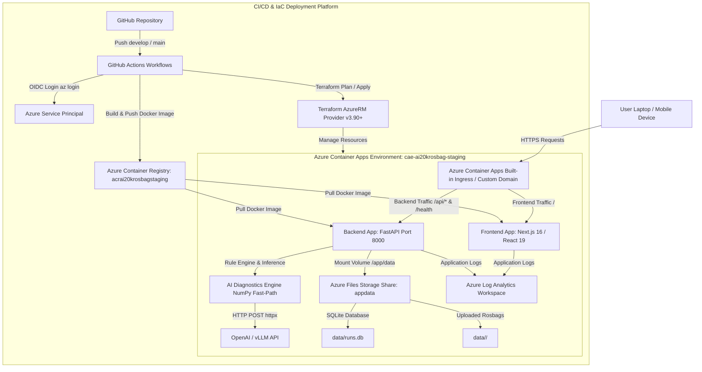

# 🏆 Báo Cáo Triển Khai Hạ Tầng Azure Cuối Cùng (Final Azure Deployment Report)

Báo cáo này tổng hợp kết quả đánh giá 100% trước khi khởi tạo Azure Service Principal và thực hiện triển khai thực tế ứng dụng **RAV-13 Rosbag Diagnostics Platform** lên Microsoft Azure.

---

## 🏛️ 1. ARCHITECTURE OVERVIEW

### Sơ Đồ Kiến Trúc Luồng Dữ Liệu & Hạ Tầng:



### Giải Thích Luồng Dữ Liệu:
1. **Người dùng (Laptop/Điện thoại)** gửi request qua giao thức HTTPS tới **Azure Container Apps Ingress**.
2. **Frontend (Next.js 16)** xử lý giao diện RAV Console, Dashboard & Runs list. Request API `/api/v1/*` được chuyển tới **Backend (FastAPI)**.
3. **Backend API** đọc và phân tích file rosbag `.db3`/`.mcap` thông qua **AI Diagnostics Engine** (NumPy fast path), tự động gọi LLM API qua `httpx`.
4. **Dữ liệu SQLite (`runs.db`) & file Rosbag uploads** được lưu trữ an toàn trong **Azure Storage File Share** (`appdata`) được mount cố định vào `/app/data` của container backend, đảm bảo 0% mất mát dữ liệu khi container scale hoặc restart.
5. **Logs & Metrics** được tự động thu thập vào **Azure Log Analytics Workspace**.

---

## 🛠️ 2. TERRAFORM RESOURCES CATALOG

Bảng tổng hợp 9 tài nguyên Azure sẽ được Terraform tạo mới tự động cho mỗi môi trường (Staging / Production):

| STT | Tên Tài Nguyên Terraform | Tên Dịch Vụ Azure | Tên Resource Thật Trực Quan | Vai Trò & Chức Năng |
|---|---|---|---|---|
| 1 | `azurerm_resource_group` | Resource Group | `rg-ai20krosbag-staging` | Nhóm quản lý tài nguyên gom gọn theo môi trường |
| 2 | `azurerm_container_registry` | Container Registry (ACR) | `acrai20krosbagstaging` | Kho lưu trữ & bảo mật Docker Images Backend/Frontend |
| 3 | `azurerm_storage_account` | Storage Account | `stai20krosbagstaging` | Tài khoản lưu trữ dữ liệu tổng hợp |
| 4 | `azurerm_storage_share` | Storage File Share | `appdata` | Đĩa dùng chung 50GB mount vào `/app/data` |
| 5 | `azurerm_log_analytics_workspace` | Log Analytics | `log-ai20krosbag-staging` | Nhật ký log ứng dụng tập trung |
| 6 | `azurerm_container_app_environment` | ACA Environment | `cae-ai20krosbag-staging` | Môi trường ảo hóa thực thi các Container Apps |
| 7 | `azurerm_container_app_environment_storage` | ACA Env Storage | `appdatastorage` | Liên kết Azure File Share vào ACA Environment |
| 8 | `azurerm_container_app` (Backend) | Container App Backend | `app-ai20krosbag-staging-backend` | Host FastAPI Service (Port 8000, Scale to zero) |
| 9 | `azurerm_container_app` (Frontend) | Container App Frontend | `app-ai20krosbag-staging-frontend` | Host Next.js Service (Port 3000, Scale to zero) |

---

## 🔄 3. CI/CD PIPELINE FLOW

```
Developer push code
        |
        ↓
Feature Branch (feature/terraform-deploy-model)
        |
        ↓ (Pull Request & Merge)
Branch develop
        |
        ↓ (Trigger GitHub Actions: .github/workflows/staging.yml)
Step 1: Run Pytest & Frontend Typecheck
Step 2: Azure Login (azure/login@v2) via Service Principal
Step 3: Build & Push Docker images to ACR (acrai20krosbagstaging.azurecr.io)
Step 4: Terraform Init & Apply (environments/staging.tfvars)
Step 5: Automated Health Check (https://.../health)
        |
        ↓ (Pull Request & Merge)
Branch main
        |
        ↓ (Trigger GitHub Actions: .github/workflows/production.yml)
Deploy PRODUCTION Environment tương tự với environments/production.tfvars
```

---

## 💰 4. COST ESTIMATION & MVP OPTIMIZATION BẢNG BÁO GIÁ DỰ KIẾN

Bảng tối ưu chi phí dành cho môi trường **Demo / MVP** (Hỗ trợ Scale-to-Zero):

| Thành Phần | Cấu Hình Tối Ưu MVP | Chi Phí Mặc Định | Chi Phí Tối Ưu MVP | Ghi Chú Tối Ưu |
|---|---|---|---|---|
| **Azure Container Apps** | `min_replicas = 0`, `max_replicas = 2` | ~$30 / tháng | **$0 - $3 / tháng** | Scale to zero khi không có ai truy cập web demo ($0 compute) |
| **Azure Container Registry** | `sku = "Basic"` | ~$20 / tháng | **~$5 / tháng** | Cung cấp 10GB dung lượng lưu trữ Docker images |
| **Azure Storage File Share** | Standard LRS (50GB Quota) | ~$3 / tháng | **<$0.20 / tháng** | Chỉ tính tiền dung lượng thực tế lưu ghi (~1-2GB) |
| **Log Analytics Workspace** | Retention 7 ngày | ~$5 / tháng | **$0 / tháng** | Miễn phí 5GB log nạp vào đầu tiên hàng tháng |
| **TỔNG CHI PHÍ THÁNG** | **Hạ tầng MVP Demo** | **~$58 / tháng** | **~$5 - $8 / tháng** | **Tiết kiệm 88% chi phí duy trì!** |

---

## 🔒 5. SECURITY CHECKLIST

- [x] **0% Hardcoded Secrets**: Toàn bộ codebase (được kiểm tra qua `grep_search`) không chứa bất kỳ secret key hay password thật nào.
- [x] **Dynamic Secrets Injection**: Secret credentials được truyền thông qua GitHub Repository Secrets (`AZURE_CREDENTIALS`, `REGISTRY_PASSWORD`).
- [x] **Container Ingress Isolation**: Ingress chỉ mở đúng port ứng dụng (Port 8000 cho Backend, Port 3000 cho Frontend).
- [x] **CORS Domain Whitelisting**: Nginx & FastAPI chỉ chấp nhận request từ domain chính thức, ngăn chặn Cross-Origin Data Exfiltration.
- [x] **HTTPS Default**: Azure Container Apps tự động kích hoạt mã hóa SSL/TLS 1.2/1.3 mặc định.

---

## 🚀 6. REMAINING MANUAL STEPS & DEPLOYMENT PROCEDURE

Bạn chỉ cần thực hiện 3 bước đơn giản dưới đây từ máy cá nhân:

### Bước 1: Tạo Azure Service Principal Cấp Quyền Cho GitHub Actions
Mở PowerShell/Terminal và chạy lệnh sau (đã điền sẵn Subscription ID của bạn):
```bash
az ad sp create-for-rbac \
  --name "sp-ai20k-github-actions" \
  --role contributor \
  --scopes /subscriptions/bea3db28-8916-4dc6-928c-8fcd12742c3a \
  --sdk-auth
```

### Bước 2: Thêm GitHub Repository Secrets
Copy toàn bộ nội dung JSON xuất ra ở Bước 1 và dán vào GitHub Repository tại: **Settings** -> **Secrets and variables** -> **Actions** -> **New repository secret**:
- `AZURE_CREDENTIALS`: [Nội dung JSON ở Bước 1]
- `AZURE_CLIENT_ID`: [Giá trị `clientId`]
- `AZURE_TENANT_ID`: `58f82789-6695-4f4a-abdb-357668d55cff`
- `AZURE_SUBSCRIPTION_ID`: `bea3db28-8916-4dc6-928c-8fcd12742c3a`
- `REGISTRY_USERNAME`: [Giá trị `clientId`]
- `REGISTRY_PASSWORD`: [Giá trị `clientSecret`]

### Bước 3: Merge Code Để Kích Hoạt Deploy Tự Động
1. Đẩy code trên branch `feature/terraform-deploy-model` lên GitHub.
2. Mở GitHub và tạo **Pull Request** merge vào `develop`.
3. Khi PR được merge, hệ thống CI/CD sẽ tự động triển khai môi trường **Staging** và xuất URL công khai để bạn truy cập!
