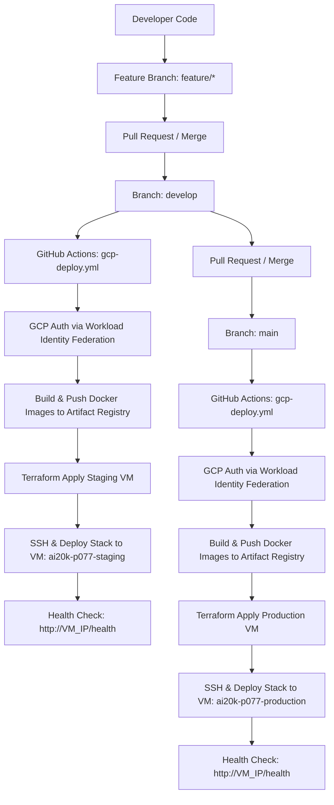

# 🤖 RAV-13 — Rosbag Diagnostics Platform

Nền tảng phân tích và chẩn đoán sự cố cho robot thông qua dữ liệu rosbag: tải lên dataset, chạy phát hiện anomaly thật trên file `*.db3` (rosbag2 SQLite), xem kết quả trên web console và trao đổi với LLM.

## 🎯 Problem Statement

Robot ghi lại dữ liệu cảm biến dưới dạng rosbag, nhưng việc tìm ra **tại sao robot gặp trục trặc** (topic chết, node im lặng, publish bị gián đoạn) vẫn là việc thủ công: phải mở công cụ nặng, kéo timeline, đo tần suất từng topic. RAV-13 tự động hoá quy trình đó:

- Phân tích **thật** dữ liệu trong bag (không dùng dữ liệu giả) ngay khi bấm **Analyze**
- Phát hiện các dạng anomaly theo thời gian: khoảng cách publish bất thường, node ngừng hoạt động
- AI hỗ trợ giải thích root cause và gợi ý cách khắc phục
- Giao diện web: quản lý dataset, xem kết quả, review đề xuất của AI

## ✨ Features

**Backend (FastAPI)**
- Upload dataset: file đơn `.db3` / `.mcap` / `.bag` hoặc zip rosbag2 (giải nén an toàn, chống zip-slip); xoá dataset
- Phân tích thật: đọc trực tiếp sqlite rosbag2 (`topics`/`messages`, timestamp ns → s) → `detect_anomalies` → run với `anomalyCount`, `worstSeverity`, cửa sổ `tSec`/`endSec`
- Quy tắc phát hiện: `frequency_gap` (gap publish), `silent_node` (node im lặng); ngưỡng cấu hình được qua API và persist tại `data/diagnostics/thresholds.json`
- API diagnostics: `POST /analysis/diagnose` (inline hoặc file), `POST /analysis/explain` (LLM, chống prompt injection)
- Chat: gọi endpoint OpenAI-compatible (vLLM / OpenAI) qua `httpx` thuần, có tham số `tools` làm nền tảng cho tool-calling thủ công — **không dùng LangGraph/LangChain**
- Tài liệu API tự động: `http://localhost:8000/docs`

**Frontend (Next.js/React)**
- RAV Console: registry dataset (upload/delete, chọn nhiều, "Analyze selected")
- Run detail: danh sách anomaly, timeline, log stream, kết quả AI + review
- Dashboard overview: tổng quan metrics, top issues, severity, xu hướng, recent runs

## 📊 Benchmark

Đo trên 48 bản ghi ROS 2 thật (38 bag tiêm 56 lỗi + 10 bag sạch),
n=3 lượt, `gpt-4.1` — median [min–max]:

| Chỉ số | Giá trị |
|---|---|
| Phát hiện lỗi | **98.2%** (55/56 lỗi tiêm) |
| Báo nhầm trên bag sạch | **0.2 cảnh báo/bag** |
| Root cause đúng | **87.7%** [87.7–89.2] (baseline ban đầu: 44.9%) |
| Mỗi lỗi có chẩn đoán riêng | **82.1%** [82.1–83.9] |
| Trần lý thuyết (cụm chứa manh mối) | **96.9%** |
| Chi phí một lượt chạy đủ 48 bag | ~0.48 USD |

Tái lập: `python scripts/eval_root_cause.py --runs 3` ·
Phương pháp & lịch sử các vòng tối ưu: [docs/benchmark.md](docs/benchmark.md)

## 🏗️ Tech Stack

| Layer | Công nghệ |
|-------|-----------|
| Backend | Python 3.11+, FastAPI, Pydantic v2, uvicorn, httpx, numpy |
| Frontend | Next.js 16 (App Router), React 19, TypeScript, shadcn/ui, Tailwind CSS v4, Recharts, SWR |
| Testing | pytest + pytest-asyncio + pytest-cov, Vitest, Playwright |
| Infrastructure | Terraform (Google Cloud Platform: Compute Engine, Artifact Registry, Cloud Storage) |
| CI/CD | GitHub Actions (`gcp-deploy.yml`, `ci.yml`, `codeql.yml`, `docker-security.yml`, `gitleaks.yml`, `trivy.yml`) |

## 📁 Cấu trúc dự án

```
├── src/
│   ├── api/routes.py            # REST API (datasets, analysis, chat, review, diagnostics)
│   ├── services/
│   │   ├── experiments.py       # Upload/delete/scan datasets từ data/
│   │   ├── diagnostics.py       # parse_rosbag2_db3, parse_mcap_file, detect_anomalies
│   │   ├── diagnostics_config.py# Ngưỡng phát hiện (defaults + persist)
│   │   └── llm.py               # chat_completion qua httpx (tool-calling thủ công)
│   ├── models/schemas.py        # Pydantic models
│   ├── config.py                # Settings từ .env (pydantic-settings)
│   └── main.py                  # FastAPI app
├── frontend/
│   ├── app/                     # Next.js App Router (console, runs, dashboard...)
│   ├── components/              # RAV Console, analysis UI, shadcn/ui
│   └── lib/                     # api client, types, mock store
├── terraform/gcp/               # Infrastructure as Code (Google Cloud Platform)
│   ├── main.tf                  # Compute Engine VM, Artifact Registry, Firewall, Service Account
│   ├── variables.tf             # Biến cấu hình (region, machine_type, environment)
│   ├── outputs.tf               # VM Public IP, Artifact Registry URL
│   ├── providers.tf             # Google Provider & Backend configuration
│   └── environments/            # File cấu hình riêng biệt cho Staging & Production
├── nginx/                       # Reverse proxy Nginx config (gcp-nginx.conf)
├── .github/workflows/
│   ├── gcp-deploy.yml           # CI/CD tự động deploy lên GCP VM khi merge vào develop / main
│   ├── ci.yml                   # CI PR Gatekeeper Tests (Backend + Frontend)
│   ├── codeql.yml               # CodeQL Security Analysis
│   ├── docker-security.yml      # Docker Image Vulnerability Scanning
│   ├── gitleaks.yml             # Secret Leak Detection
│   └── trivy.yml                # Trivy Vulnerability Scanner
├── data/                        # Local storage data & thresholds
├── tests/                       # Pytest test suite
└── Dockerfile                   # Multi-stage Docker build
```

---

## 🚀 Deployment & CI/CD Guide (Google Cloud Platform - GCP)

### 🌐 1. Kiến Trúc Deployment GCP

Hệ thống được triển khai trên hạ tầng **Google Cloud Platform (GCP)** với 2 môi trường biệt lập (**Staging** và **Production**):



#### Ánh Xạ Dịch Vụ Hạ Tầng:
- **Compute Platform**: **Google Compute Engine (GCE) VM** — chạy Docker stack với Docker Compose (`e2-small` cho Staging, `e2-medium` cho Production).
- **Container Registry**: **GCP Artifact Registry** — lưu trữ & bảo mật các Docker image Backend & Frontend tại region `asia-southeast1` (Singapore).
- **Reverse Proxy**: **Nginx** — cân bằng tải và điều hướng routing `/api/*` tới Backend và `/` tới Frontend trên cổng 80.
- **Persistent Data Volume**: Thư mục `/opt/app/data` trên VM — bảo toàn dữ liệu SQLite (`runs.db`) và rosbag upload.
- **Terraform State Backend**: **Google Cloud Storage (GCS)** (`tfstate-ai20k-p077-gcp`).

---

### 💻 2. Cách Chạy Local

#### Option A: Uvicorn + Node (Khuyến nghị cho Dev)
```powershell
# 1. Backend:
python -m venv .venv
.\.venv\Scripts\Activate.ps1
pip install -e ".[dev]"
Copy-Item .env.example .env
uvicorn src.main:app --reload --port 8000

# 2. Frontend:
cd frontend
pnpm install
pnpm dev
```

#### Option B: Docker Compose (Local)
```bash
# Development (Hot reload):
docker compose --profile dev up --build

# Production: deploy tự động lên VM GCP qua CI/CD khi merge vào `main`
# (xem .github/workflows/gcp-deploy.yml và scripts/gcp/deploy.sh)
```

---

### 🧪 3. Quy Trình Deploy Staging (GCP)

Deployment cho Staging diễn ra **hoàn toàn tự động** khi code được merge vào nhánh `develop`.

#### Các bước thực hiện thủ công bằng Terraform:
```bash
cd terraform/gcp
# Khởi tạo Terraform GCP Backend
terraform init -backend-config="prefix=terraform-gcp/staging"

# Kiểm tra kế hoạch thay đổi hạ tầng Staging trên GCP
terraform plan -var-file=environments/staging.tfvars

# Apply hạ tầng Staging
terraform apply -var-file=environments/staging.tfvars -auto-approve
```

---

### 🏭 4. Quy Trình Deploy Production (GCP)

Deployment cho Production diễn ra **hoàn toàn tự động** khi code từ `develop` được merge vào nhánh `main`.

#### Các bước thực hiện thủ công bằng Terraform:
```bash
cd terraform/gcp
# Khởi tạo & Apply hạ tầng Production trên GCP
terraform init -backend-config="prefix=terraform-gcp/production"
terraform plan -var-file=environments/production.tfvars
terraform apply -var-file=environments/production.tfvars -auto-approve
```

---

### 🔑 5. Danh Mục Biến Môi Trường (Environment Variables)

| Biến Môi Trường | Mô Tả | Mặc Định Staging | Mặc Định Production |
|---|---|---|---|
| `APP_ENV` | Môi trường ứng dụng | `staging` | `production` |
| `APP_PORT` | Port lắng nghe Backend | `8000` | `8000` |
| `CORS_ORIGINS` | Tên miền CORS được phép | `http://localhost:3000` | `https://yourdomain.com` |
| `RUN_DB_PATH` | File đường dẫn SQLite | `data/runs.db` | `data/runs.db` |
| `OPENAI_API_KEY` | Key gọi LLM | Staging Key | Production Key |
| `LOG_LEVEL` | Cấp độ ghi Log | `DEBUG` | `INFO` |

---

### 🔀 6. Quy Trình Thử Nghiệm CI/CD Flow Chi Tiết

1. **Feature Branch Work**:
   ```bash
   git checkout -b feature/your-feature-name
   git add .
   git commit -m "feat: implement new diagnostic rule"
   git push origin feature/your-feature-name
   ```

2. **Deploy STAGING (Merge vào `develop`)**:
   - Tạo PR từ `feature/your-feature-name` vào `develop`.
   - Workflow `.github/workflows/gcp-deploy.yml` tự động chạy test, build & push Docker image lên Artifact Registry, apply Terraform GCP và deploy lên VM `ai20k-p077-staging`.

3. **Deploy PRODUCTION (Merge vào `main`)**:
   - Tạo PR từ `develop` vào `main`.
   - Workflow `.github/workflows/gcp-deploy.yml` tự động chạy testsuite, build & push Docker image lên Artifact Registry, apply Terraform GCP và deploy lên VM `ai20k-p077-production`.

---

## 🧪 Testing

```powershell
# Backend (venv):
.\.venv\Scripts\Activate.ps1
pytest tests -q

# Lint
ruff check src tests

# Frontend: unit + typecheck
npm run frontend:lint
```
