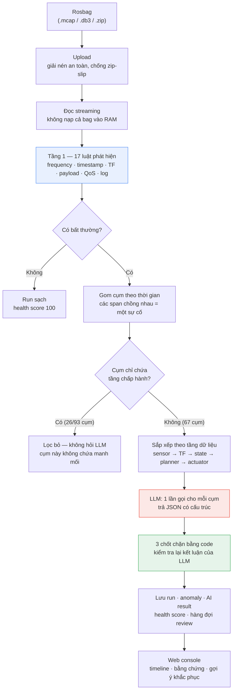
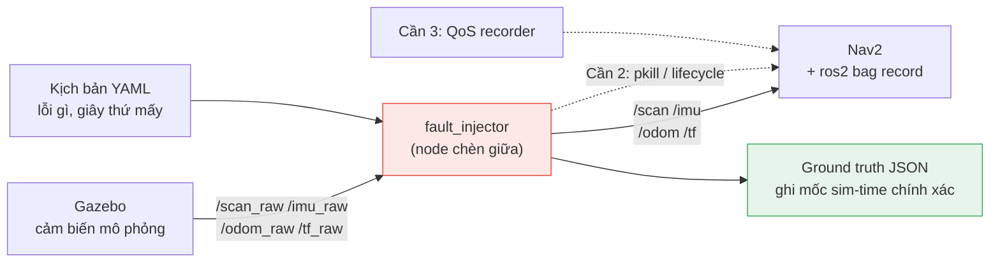
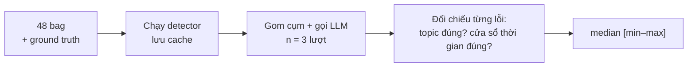

# RAV-13 — Chẩn đoán sự cố robot từ rosbag

> Tài liệu trình bày Demo Day. Mọi con số trong file đều đo trực tiếp trên
> 48 bản ghi ROS 2 thật, không phải số lý thuyết.

---

## 1. Đề tài và vấn đề cần giải

### Robot ghi lại mọi thứ, nhưng không ai đọc nổi

Một robot tự hành (AMR) chạy trong kho hàng liên tục ghi dữ liệu vào **rosbag** —
hộp đen của robot. Một bản ghi 3 phút chứa khoảng **80.000 message** trên 8 kênh:
LiDAR quét vật cản, IMU đo gia tốc, odometry đo quãng đường, cây biến đổi toạ độ TF,
lệnh vận tốc gửi xuống bánh xe.

Khi robot đứng khựng giữa kho, câu hỏi của kỹ sư luôn là: **tại sao?**

### Quy trình hiện tại

```
Robot dừng  →  Copy bag về máy  →  Mở rqt/PlotJuggler  →  Kéo timeline
            →  Đo tần suất từng topic bằng mắt  →  Đoán  →  Thử lại
```

Bốn điểm đau:

| Vấn đề | Hệ quả |
|---|---|
| **Công cụ nặng, thủ công** | Mở PlotJuggler, kéo timeline 3 phút × 8 topic để tìm một khoảng trống 2 giây |
| **Triệu chứng che mất nguyên nhân** | LiDAR chết → TF gãy → planner treo → `/cmd_vel` im. Kỹ sư thấy `/cmd_vel` im trước tiên, vì đó là thứ dễ nhận ra nhất — nhưng đó là **hệ quả cuối chuỗi**, không phải thủ phạm |
| **Số lượng đánh lừa** | Một `/cmd_vel` chết sinh ra hàng chục cảnh báo; LiDAR gây ra nó chỉ sinh **một**. Ai đếm cảnh báo sẽ luôn đổ lỗi sai chỗ |
| **Kiến thức không nhân bản được** | Người đọc được bag là người đã sửa 50 sự cố. Người mới mất hàng giờ cho việc mà người cũ nhìn 30 giây |

### RAV-13 làm gì

Tải bag lên → bấm **Analyze** → nhận lại: **chuyện gì hỏng, hỏng lúc nào, cái nào là
nguyên nhân gốc, và nên làm gì tiếp theo**.

Điểm mấu chốt của thiết kế: **luật cứng tìm bất thường, LLM chỉ xếp thứ tự nhân quả.**
Luật cứng thì tái lập được và không bịa; LLM giỏi việc luật không làm nổi — đọc một
chùm triệu chứng rồi nói cái nào kéo theo cái nào. Không dùng LLM để đếm số, không
dùng luật để suy diễn nhân quả.

---

## 2. Workflow hệ thống



### Vì sao tách làm ba tầng

| Tầng | Việc | Vì sao không giao cho LLM |
|---|---|---|
| **Luật (code)** | Tìm bất thường, đo khoảng trống, đếm tần suất | Cần chính xác tuyệt đối và tái lập 100%. LLM đếm số sẽ sai và mỗi lần chạy một kiểu |
| **Gom cụm (code)** | Ghép các bất thường cùng khoảng thời gian thành một sự cố | Là bài toán khoảng thời gian chồng nhau — thuật toán giải đúng, không cần suy luận |
| **LLM** | Trong một chùm triệu chứng, cái nào gây ra cái nào | Đây là suy luận nhân quả trên ngữ cảnh — đúng thứ luật cứng bó tay |
| **Chốt chặn (code)** | Bác bỏ kết luận trái quy luật vật lý | LLM có lúc nói "A gây ra B" trong khi B xảy ra trước A |

Chi phí: **0,024 USD** cho một lượt phân tích trọn 48 bag — vì LLM chỉ được gọi
67 lần cho 539 bất thường, chứ không phải mỗi bất thường một lần.

---

## 3. Bộ dữ liệu: các lỗi và cách tạo ra chúng

Muốn biết hệ thống chẩn đoán đúng hay sai thì phải có **đáp án**. Không thể chờ robot
thật hỏng đúng 14 kiểu — nên chúng tôi **cố ý làm hỏng** robot mô phỏng, và ghi lại
chính xác đã hỏng cái gì, lúc mấy giây.

### Sân khấu mô phỏng

TurtleBot3 chạy Nav2 trong Gazebo, tuần tra theo lộ trình định sẵn suốt 3 phút.
Robot **phản ứng thật** với lỗi: LiDAR chết thì planner thật sự mất đầu vào và robot
thật sự dừng — nên bag thu được có đủ cả nguyên nhân lẫn chuỗi hệ quả, giống hệt
sự cố ngoài đời.

### Ba cách làm hỏng



**Cần 1 — bóp méo luồng message.** Một node đứng giữa cầu nối Gazebo và phần còn lại
của hệ thống: nó nhận message thật, làm hỏng theo lịch, rồi phát lại đúng tên topic
chuẩn. Nav2 và recorder đều không biết có kẻ đứng giữa.

**Cần 2 — giết hoặc tắt node thật.** `pkill -9 nav2_amcl/amcl` cho lỗi sập hẳn,
`ros2 lifecycle set … deactivate` cho lỗi khởi động lại. Đây là node Nav2 thật chết,
không phải mô phỏng cái chết.

**Cần 3 — đổi QoS phía ghi.** Publisher hạ xuống BEST_EFFORT trong khi recorder giữ
RELIABLE → hai đầu không bắt tay được, message mất **im lặng, không một dòng log**.

Điểm quan trọng: node tiêm lỗi chạy theo **sim-time**, nên nó ghi được mốc thời gian
chính xác lúc lỗi bật/tắt. Đáp án là số đo thật, không phải ước lượng từ đồng hồ shell.

### 14 loại lỗi

| Nhóm | Loại lỗi | Ngoài đời do đâu | Mô phỏng bằng cách |
|---|---|---|---|
| **F1 — Tần suất** | `topic_dead` | Driver LiDAR crash, đứt cáp | Ngừng phát hẳn |
| | `frequency_drop` | CPU quá tải, driver không giữ kịp nhịp | Bỏ bớt 75% message |
| | `burst` | Driver gom message rồi xả một cục | Dồn message thành cụm |
| **F2 — Đồng hồ** | `clock_drift` | Cảm biến không sync NTP/PTP với máy chủ | Dịch dần timestamp trong header |
| | `timestamp_jump` | NTP nhảy cóc về tương lai | Nhảy stamp một phát về trước |
| | `timestamp_backwards` | Node restart, đồng hồ khởi tạo lại | Nhảy stamp lùi lại |
| **F3 — Cây toạ độ** | `tf_gap` | Node phát transform ngừng, chuỗi map→odom→base đứt | Chặn một cạnh TF |
| | `tf_conflict` | Launch file khai trùng, hai node cùng phát một transform khác giá trị | Phát chèn giá trị lệch |
| | `tf_loop` | URDF sai, cây toạ độ khép thành vòng | Phát cạnh ngược tạo vòng |
| **F4 — Cấp node** | `node_crash` | OOM-kill, segfault | `pkill -9` node Nav2 thật |
| | `node_restart` | Supervisor khởi động lại node | `lifecycle deactivate` rồi `activate` |
| **F5 — Chất lượng dữ liệu** | `nan_values` | Photodiode LiDAR hỏng, mất I2C/SPI | Nhét NaN vào 30% tia quét |
| | `out_of_range` | Sai hệ số scale trong driver | Nhét giá trị vượt dải đo vật lý |
| | `inf_values` | Không có vật phản xạ trong tầm | Nhét Inf |
| **F6 — Truyền tin** | `qos_mismatch` | Cấu hình QoS hai đầu lệch nhau | Hạ publisher xuống BEST_EFFORT |
| | `message_gap` | Queue tràn theo chu kỳ | Ngừng phát từng đợt ngắn |

> **Cột "ngoài đời do đâu" là lời kể của người thiết kế kịch bản, không phải thứ hệ thống
> trả về.** Nó giải thích vì sao lỗi đó đáng tiêm, chứ không phải thứ suy ra được từ bag.
> Hệ thống trả lời *topic nào, kiểu bất thường gì, cái nào kéo theo cái nào* — xem
> [mục 3.1](#31-hệ-thống-trả-lời-tới-tầng-nào-của-chữ-nguyên-nhân).

### 3.1. Hệ thống trả lời tới tầng nào của chữ "nguyên nhân"

Chữ "nguyên nhân" có hai tầng, và cần phân biệt rõ kẻo kỳ vọng sai:

| Tầng | Ví dụ | Hệ thống trả lời được? |
|---|---|---|
| **Nguyên nhân trong dữ liệu** | "`/scan` hỏng trước do payload NaN, kéo theo `/tf` đứt rồi `/cmd_vel` im" | **Có** — đây là thứ được chấm điểm ở mục 5 |
| **Nguyên nhân vật lý** | "Photodiode của LiDAR không trả tín hiệu" | **Không** |

Đối chiếu thật trên cả 14 loại lỗi, không ca nào LLM nêu được nguyên nhân vật lý.
Gần nhất là nhóm **timestamp** và `out_of_range`, vì bản thân loại bất thường đã hàm ý
nguyên nhân: LLM gợi ý *"kiểm tra đồng bộ đồng hồ của IMU"* (ground truth: "không sync
NTP/PTP") và *"kiểm tra hiệu chuẩn cảm biến"* (ground truth: "sai hệ số scale trong driver").

**Và nó *không thể* trả lời tầng đó, vì bag không chứa thông tin cần thiết:**

| Lỗi | Ground truth nói | Bag có gì để suy ra? |
|---|---|---|
| `frequency_drop` | CPU quá tải | Không có số liệu CPU. Quá tải, driver lỗi hay đứt cáp đều để lại **dấu vết y hệt** |
| `tf_conflict` | Launch file khai trùng | Launch file không nằm trong bag |
| `nan_values` | Photodiode hỏng | Trạng thái phần cứng không nằm trong bag |
| `qos_mismatch` | Publisher tụt BEST_EFFORT | Metadata rosbag2 *có* lưu `offered_qos_profiles`, nhưng bag `F6_01` ghi `/scan` là `reliable` — **giống hệt bag sạch**. Sự lệch không lọt vào file |

Đây là hành vi **đúng thiết kế**, không phải thiếu sót. Prompt bắt buộc *"ground every claim
in the supplied data"*. Một model nhìn thấy NaN rồi tuyên bố "photodiode hỏng" nghe thuyết
phục hơn nhưng sai nhiều hơn — và kỹ sư sẽ đi tháo LiDAR trong khi lỗi nằm ở driver.
Benchmark ở mục 5 vì vậy chấm theo *đúng topic, đúng khoảng thời gian, đúng chiều nhân quả*,
không chấm theo cột "ngoài đời do đâu".

Muốn với tới tầng vật lý thì phải **cấp thêm ngữ cảnh ngoài bag** — xem mục 6.

### Quy mô bộ dữ liệu

| | Số lượng |
|---|---|
| Bag lỗi (`bags/faulty/`) | **38** — 29 bag một lỗi + 9 bag kết hợp 2–3 lỗi |
| Bag sạch (`bags/healthy/`) | **10** — không tiêm gì, dùng để đo báo động giả |
| Tổng số lần tiêm lỗi | **56** |
| Độ phủ | 14/14 loại lỗi |
| Dung lượng | ~1,6 GB |

Các bag `C_01`–`C_10` là **bag kết hợp** — 2 đến 3 lỗi trong cùng một bản ghi, có khi
chồng thời gian. Đây là phần khó nhất: hệ thống phải tách được hai sự cố độc lập thay
vì gộp thành một câu chuyện.

Mỗi bag đi kèm một file `*_ground_truth.json` ghi rõ: lỗi gì, topic nào, từ giây mấy
đến giây mấy, nguyên nhân thực tế là gì. Đó là thước đo chấm điểm ở mục 5.

---

## 4. Tầng luật: từ 80.000 message thành vài sự cố

### Bước 1 — 17 luật phát hiện

Mỗi luật trả lời một câu hỏi cụ thể, không luật nào cần AI:

| Luật | Câu hỏi | Ngưỡng |
|---|---|---|
| `frequency_gap` | Có khoảng trống bất thường giữa hai message? | Khoảng cách lớn nhất > **1,5 lần** nhịp bình thường |
| `message_drop_burst` | Có cú rơi một cụm message? | Một khoảng trống > **1 giây** |
| `silent_node` | Topic có im hẳn không? | Khoảng im > **5 lần** nhịp bình thường; **critical** nếu ≥ 20 giây |
| `hz_drop` | Tần suất có tụt so với chuẩn? | Thấp hơn **30%** (cảnh báo) / **50%** (nghiêm trọng) |
| `clock_drift` | Đồng hồ cảm biến có lệch đồng hồ máy? | Lệch > **0,1 giây** trong ≥ 3 message liên tiếp |
| `tf_missing_gap` | Cạnh TF có bị đứt? | Đứt > **0,5 giây**; critical nếu ≥ 15 giây |
| `tf_conflict` | Hai nguồn có tranh nhau một transform? | ≥ **3** cú nhảy trong cửa sổ 2 giây |
| `payload_nan` | Dữ liệu có chứa NaN? | ≥ **5** message liên tiếp có > 5% giá trị là NaN |
| `payload_out_of_range` | Giá trị có vượt dải vật lý? | Tương tự, so với `range_min`/`range_max` của chính cảm biến |

**Ví dụ cụ thể.** LiDAR bình thường phát 10 lần mỗi giây, tức cách nhau 0,1 giây.
Ngưỡng khoảng trống = max(0,08 · 1,5 × 0,1) = **0,15 giây**. Trong bag `F1_01`, LiDAR
ngừng ở giây 60 và im tới hết bag:

```
… 59,8s  59,9s  60,0s  ────────── im lặng 115 giây ────────────  hết bag
                        ↑
                        frequency_gap (0,15s < 115s)      → medium
                        message_drop_burst (1s < 115s)    → medium
                        silent_node (115s ≥ 20s)          → CRITICAL
```

Một sự kiện, ba luật cùng bắt — đó là chủ ý: mỗi luật nhìn từ một góc, và khi cả ba
cùng nổ thì độ tin cậy cao hơn hẳn một luật đơn lẻ.

Ngưỡng được hiệu chỉnh trên **10 bag sạch**: bất kỳ ngưỡng nào chặt hơn nhịp thật của
bag sạch đều sinh báo động giả. Ví dụ `/amcl_pose` nghỉ tới 3,11 giây trong lúc chạy
bình thường — luật nào coi 3 giây là lỗi sẽ báo nhầm cả 10 bag.

### Bước 2 — Gom cụm: nhiều triệu chứng, một sự cố

Bag `C_01` sinh **21 bất thường**. Nếu hỏi LLM 21 lần thì tốn 21 lần tiền và nhận về
21 mẩu rời rạc không ai ghép lại được.

Quy tắc gom: **hai bất thường có khoảng thời gian hoạt động chồng nhau thì thuộc cùng
một sự cố.**

```
/scan  payload_nan   ├──────────────────────┤
/tf    missing_gap              ├───────────────────┤
/cmd_vel silent                    ├──────────────┤
                     └──────── một cụm ────────────┘
```

Trước đây gom theo *thời điểm bắt đầu* cách nhau bao xa. Cách đó làm vỡ vụn các sự cố
dài: một cú đứt TF 40 giây và cú treo controller do nó gây ra đều kéo dài hàng chục
giây, nhưng thời điểm bắt đầu cách nhau hơn 5 giây nên bị tách thành hai cụm khác nhau
— nguyên nhân nằm cụm này, hệ quả nằm cụm kia, và không cụm nào trả lời được.
Đổi sang gom theo **khoảng chồng nhau**, tỉ lệ cụm chỉ chứa hệ quả giảm từ 49,3% xuống
18,2%.

### Bước 3 — Lọc bỏ cụm không chứa manh mối

Có những cụm chỉ chứa duy nhất `/cmd_vel` — bánh xe ngừng quay, và lý do **không nằm
trong cụm đó**. Hỏi LLM thì câu trả lời chỉ có thể là "`/cmd_vel` hỏng", tức sai theo
đúng nghĩa đen. **26 trong 93 cụm** bị lọc từ trước, tiết kiệm 28% chi phí LLM và loại
bỏ hẳn một nguồn trả lời sai.

Lưu ý: phép lọc xét trên **toàn bản ghi**, không xét từng cụm. Nếu cả bag không có bất
thường nào ở tầng trên, thì `/cmd_vel` đúng là thủ phạm và cụm đó vẫn được giải thích
bình thường.

### Bước 4 — Xếp theo tầng dữ liệu trước khi hỏi LLM

Dữ liệu trong ROS chảy một chiều:

```
sensor  →  transform  →  state_estimate  →  planner  →  actuator
/scan      /tf           /odom              /plan       /cmd_vel
/imu                     /amcl_pose
```

Lỗi chỉ lan **xuôi chiều**. Hai xử lý trước khi gửi cho LLM:

1. **Gộp lặp.** Một topic chết sinh một bất thường cho mỗi đợt vi phạm — `/cmd_vel`
   hấp hối có thể áp đảo nguyên nhân giết nó với tỉ số 13 dòng ăn 1 dòng. Các bất
   thường trùng (topic, loại) được gộp thành một dòng kèm số lần lặp, để model không
   bị số đông đánh lừa.
2. **Sắp xếp ngược dòng trước.** Cảm biến đứng trước TF, TF trước bánh xe, kèm nhãn
   tầng ghi rõ. Model tựa nhiều vào thứ tự trình bày, nên thứ tự đó phải mang đúng
   thông tin vật lý.

### Bước 5 — Ba chốt chặn kiểm tra lại LLM

LLM trả JSON có cấu trúc: mỗi bất thường được gán vai **primary** (nguyên nhân) hoặc
**consequence** (hệ quả). Code kiểm lại ba điều, theo đúng thứ tự này:

| Chốt chặn | Bác bỏ điều gì | Vì sao cần |
|---|---|---|
| **Đồng thời** | Hai thứ chết cách nhau 10–30 mili-giây mà vẫn bị gán nhân–quả | Prompt đã dặn rồi, model vẫn vi phạm ở mức mili-giây |
| **Thứ tự nhân quả** | A bị gọi là hệ quả của B trong khi A xảy ra **trước** B | Đo được: `/cmd_vel` im từ giây 304, `/tf` xung đột mãi giây 331 — model vẫn nói `/tf` gây ra `/cmd_vel`, và trích đúng hai mốc đó trong câu trả lời của chính nó |
| **Tầng chấp hành** | `/cmd_vel` bị gọi là nguyên nhân trong khi có lỗi ngược dòng bắt đầu **trước** nó | Nhầm lẫn này từng chiếm 84% số kết luận sai |

Khi phát hiện thứ tự bất khả thi, hệ thống **hỏi lại model một lần**, trích chính các
mốc thời gian của nó ra: *"index 2 (/cmd_vel) bắt đầu ở 304,020s. Bất thường sớm nhất
bạn gán primary là /tf ở 331,230s. Hệ quả không thể bắt đầu trước nguyên nhân."*
Đo trên toàn bộ corpus: chỉ **2–3 trong 65 cụm** cần hỏi lại, và model tự sửa được ở
mọi lần. Nếu lượt hỏi lại vẫn sai, code sửa vai trò và chèn một câu đính chính.

Chi tiết thú vị: `gpt-4.1` **không hề mắc lỗi này** ở cả 3 lượt chạy, còn `gpt-4o-mini`
mắc 2–4 lần mỗi lượt. Chốt chặn là chiếc nạng cho model rẻ — và nhờ có nó, model rẻ
đạt kết quả ngang model đắt.

---

## 5. Benchmark: đo thế nào và được bao nhiêu

### Bốn chỉ số, mỗi cái trả lời một câu hỏi khác nhau

| Chỉ số | Câu hỏi | Vì sao quan trọng |
|---|---|---|
| **Recall của detector** | Trong 56 lỗi tiêm, tầng luật bắt được bao nhiêu? | Bỏ sót ở đây thì LLM không có gì để suy luận |
| **Báo động giả** | Trên 10 bag sạch, hệ thống la làng bao nhiêu lần? | Hệ thống hay báo nhầm sẽ bị kỹ sư tắt đi |
| **`root_cause_pct`** | Trong các kết luận sinh ra, bao nhiêu % chỉ đúng thủ phạm? | Đo chất lượng suy luận nhân quả |
| **`fault_diagnosed_pct`** | Mỗi lỗi tiêm có một kết luận **riêng** nêu đúng topic và đúng khoảng thời gian của nó không? | **Khắt khe nhất.** Một bag hai lỗi mà chỉ ra một kết luận thì chỉ số này bắt được, `root_cause_pct` thì không |

Khoảng chênh giữa hai chỉ số cuối chính là **mức độ gộp quá tay** — bao nhiêu sự cố
độc lập bị dồn thành một câu chuyện.

Ngoài ra còn một **trần lý thuyết**: tỉ lệ cụm có chứa topic đúng của lỗi. Cụm không
chứa manh mối thì không model nào trả lời đúng được. Trần hiện tại: **96,9%**.

### Cách chấm điểm



Hai nguyên tắc giữ cho số liệu có ý nghĩa:

- **Cô lập ngưỡng.** Server đang chạy có thể ghi đè ngưỡng đã tinh chỉnh vào file cấu
  hình giữa chừng, làm detector đổi hành vi âm thầm. Một lần đo từng bị vô hiệu vì lý
  do này — báo động giả trên bag sạch nhảy từ 0,2 lên 4,2 mỗi bag. Script benchmark
  nay ghim ngưỡng riêng và **từ chối chạy** nếu phát hiện ngưỡng khác đang có hiệu lực.
- **Tách detector khỏi LLM.** Kết quả phát hiện được cache, nên thử nghiệm gom cụm và
  prompt chạy được **không tốn một token nào**.
- **n = 3 lượt.** LLM không tất định. Đo n=1 rồi khoe chênh lệch 1 ca là tự lừa mình —
  biên dao động tự nhiên đo được là **±2 ca**.

### Kết quả hiện tại

Model `gpt-4o-mini`, n=3, median [min–max]:

| Chỉ số | Kết quả |
|---|---|
| Phát hiện lỗi tiêm | **98,2%** — 55/56 |
| Báo động giả trên bag sạch | **0,2 cảnh báo/bag** — 2 trên 10 bag, đều là khoảng trống ~150 ms |
| Chỉ đúng thủ phạm (`root_cause_pct`) | **92,3%** [89,2–92,3] |
| Mỗi lỗi có chẩn đoán riêng (`fault_diagnosed_pct`) | **87,5%** [83,9–87,5] |
| Trần lý thuyết | **96,9%** |
| Chi phí một lượt trọn 48 bag | **0,024 USD** |
| Thời gian | ~12 phút đọc bag + ~12 phút gọi LLM |

Đối chiếu với mốc trước khi tối ưu — cùng bộ dữ liệu, cùng công thức chấm, nhưng mốc cũ
đo trên `gpt-4.1`:

| | Trước | Sau |
|---|---|---|
| `root_cause_pct` | 87,7% [87,7–89,2] | **92,3%** [89,2–92,3] |
| `fault_diagnosed_pct` | 82,1% [82,1–83,9] | **87,5%** [83,9–87,5] |
| Chi phí/lượt | ~0,48 USD (`gpt-4.1`) | **0,024 USD** (`gpt-4o-mini`) |

Nói cho sòng phẳng: median vượt trên mốc cũ ở cả hai chỉ số, nhưng hai dải **vẫn chạm
nhau ở mép** (min của bản mới đúng bằng max của bản cũ). Với n=3 thì đây là dấu hiệu
rõ, chưa phải bằng chứng thống kê mạnh.

### Một phát hiện đáng tiền

`gpt-4o-mini` **ngang `gpt-4.1`** trên cả hai chỉ số chính, với **1/17 chi phí**
(0,024 so với 0,40 USD mỗi lượt) — đo bằng cách chạy cả hai model n=3 trên cùng một
cache kết quả phát hiện. Với bài toán này, tiền bỏ thêm cho model mạnh không mua được
độ chính xác — nó chỉ mua được việc bớt cần chốt chặn.

### Độ ổn định giữa các lượt

| | Số lỗi |
|---|---|
| Đúng cả 3 lượt | **53/56** |
| Sai cả 3 lượt | 1/56 — `F4_05`, xem mục 6 |
| Lúc đúng lúc sai | 2/56 — đều là ca cụm bị gộp |

---

## 6. Hạn chế và hướng phát triển

### Đang còn hạn chế

**1. Câu văn có thể mâu thuẫn với bảng bằng chứng.**
Các chốt chặn chỉ sửa được **vai trò** của từng bất thường, không sửa được câu tóm tắt
dạng văn xuôi — đó là đầu ra tự do của model. Ví dụ thật trong bản chạy hiện tại, bag
`C_08`: câu tóm tắt viết *"/scan hỏng trước, kéo theo /tf"*, trong khi `/tf` bắt đầu
**sớm hơn 30 mili-giây**. Chênh 30 ms là chết cùng lúc, không phải nhân quả. Chốt chặn
chỉ bác được thứ tự **bất khả thi** (hệ quả xảy ra trước nguyên nhân), không bác được
kiểu khẳng định nhân quả cho một thế đồng thời. Người vận hành đọc câu tóm tắt trước —
đây là rủi ro chất lượng thật duy nhất còn lại.

**2. Gom cụm quá tay — hai sự cố độc lập bị kể thành một câu chuyện.**

Đây là rủi ro lớn nhất của thiết kế gom cụm, và nó đo được:

| | Số đo |
|---|---|
| Cụm chứa từ 2 lỗi tiêm trở lên | **6/65** |
| Lỗi phải chia chung cụm với lỗi khác | **10/56** |
| Lỗi trượt **vì** bị gộp | **4/56** — `C_01/tf_gap`, `C_08/tf_loop`, `C_10/tf_conflict`, `C_10/restart` |

Bốn ca đó chiếm gần trọn khoảng chênh 4,8 điểm giữa `root_cause_pct` (92,3%) và
`fault_diagnosed_pct` (87,5%). Hậu quả thực tế: cụm chỉ sinh **một** kết luận, nên lỗi thứ
hai bị kể thành hệ quả của lỗi thứ nhất — kỹ sư đi sửa LiDAR, robot vẫn hỏng vì cú đứt TF
là lỗi độc lập.

**Nguyên nhân không phải "hai lỗi tình cờ trùng giờ", mà là hiệu ứng dây chuyền.**
Gom cụm dùng liên kết đơn: A chồng B, B chồng C thì cả ba một cụm, dù A và C cách xa nhau.

| Bag | Hai lỗi cách nhau | Cái gì bắc cầu |
|---|---|---|
| `C_08` | Cửa sổ **không chồng**, cách 5 s | Một `tf_missing_gap` kéo dài **110 giây** — sống lâu hơn cửa sổ tiêm (87–142 s), nuốt trọn sự cố `/scan` ở 147–207 s |
| `C_10` | Cách 24 s, **không chồng** | `header_latency` dài 32 s nối cụm restart (554 s) sang cụm `tf_conflict` (584 s) |
| `C_01` | Chồng thật 10 s | `/scan` NaN 155–215 và `/tf` gap 205–250 — chỉ ca này mới là trùng giờ thật |

Chỉ 1 trong 3 ca là trùng giờ thật; hai ca còn lại là khiếm khuyết thuật toán, sửa được.

**Cái đang che chắn:** mỗi bất thường vẫn giữ **dòng riêng** trong bảng bằng chứng với vai
trò và mô tả riêng, nên cú đứt TF vẫn hiện ra, chỉ bị gán nhãn "hệ quả". Và model được phép
gán nhiều primary: trong 10 lỗi phải chia chung cụm, **9 lỗi vẫn được nêu đúng topic** ở
bảng bằng chứng qua cả 3 lượt. Chỉ câu tóm tắt là nêu một thủ phạm duy nhất.

**3. Một số cơ chế lỗi không nhìn thấy được từ bag.**

| Lỗi | Detector thấy gì | Vì sao |
|---|---|---|
| `timestamp_jump`, `timestamp_backwards` | đều là `clock_drift` | Chưa có luật riêng phân biệt nhảy cóc với trôi dần |
| `qos_mismatch` | `silent_node` + `frequency_gap` | Cấu hình QoS không nằm trong bag — chỉ thấy hậu quả |
| `tf_loop` | `tf_missing_gap` | Chưa có luật kiểm tra vòng trong cây TF |
| `node_crash` vs `node_restart` | không phân biệt | Bag ROS 2 **không lưu tên node publisher**; trường `node` hiện chỉ suy ra từ tên topic |

**4. Không trả lời được tầng nguyên nhân vật lý.**
Hệ thống nói "`/scan` hỏng trước do NaN", không nói "photodiode hỏng" — vì bag không chứa
thông tin để phân biệt hỏng phần cứng với lỗi driver. Chi tiết ở [mục 3.1](#31-hệ-thống-trả-lời-tới-tầng-nào-của-chữ-nguyên-nhân).
Đây là giới hạn của **dữ liệu đầu vào**, không phải của model: cấp thêm ngữ cảnh thì mới
tiến xa hơn được.

**5. Một lỗi dữ liệu trong bộ benchmark.**
`F4_05` là ca duy nhất sai ở **cả 3 lượt**: ground truth khai lỗi trên `/plan`, nhưng
bag không hề ghi topic đó. Detector không thể bắt thứ không tồn tại. Trần recall bị ghim
ở 55/56 cho tới khi ghi lại bag hoặc sửa nhãn.

**6. Chưa thử trên robot thật.** Toàn bộ số liệu đến từ TurtleBot3 trong Gazebo.
Bag thật có nhiều topic hơn, nhịp publish bẩn hơn, và các dạng hỏng chưa từng nghĩ tới.

### Hướng phát triển

**Ngắn hạn — đóng nốt các hạn chế trên**

1. **Bắt câu văn phải khớp bằng chứng.** Cho model xuất thứ tự nhân quả dưới dạng có
   cấu trúc trước, rồi sinh văn xuôi **từ** cấu trúc đó — thay vì sinh cả hai song song
   rồi mới đối chiếu.
2. **Chặn hiệu ứng dây chuyền khi gom cụm.** Ba việc, xếp theo tỉ lệ lợi/công:
   không cho bất thường tầng chấp hành (`/cmd_vel`) làm cầu nối — gom cụm trên các bất
   thường ngược dòng trước rồi mới gắn actuator vào; chặn cụm quá dài — hai bất thường
   `critical` trên hai topic khác nhau, bắt đầu cách nhau hơn 30 giây, nên là hai cụm; và
   cho phép nhiều kết luận trên một cụm, cho ca thật sự đồng thời.
   **Thử nghiệm phần này không tốn một token nào** — kết quả phát hiện đã cache, chất lượng
   gom cụm đo offline bằng `cluster_with_gt_pct` và `singleton_pct`, script benchmark có sẵn
   cờ `--slack` để quét.
3. **Thêm luật cho các cơ chế đang lẫn lộn**: phân biệt nhảy cóc với trôi dần, kiểm tra
   vòng trong cây TF.
4. **Cấp bản đồ `topic → node`.** Reader đã có sẵn tham số này. Khai báo `/amcl_pose`
   và cạnh `map→odom` cùng thuộc node `amcl` sẽ cho hệ thống căn cứ thật để kết luận
   "node amcl chết" thay vì suy đoán từ thứ tự thời gian.
5. **Nạp thêm ngữ cảnh ngoài bag để với tới nguyên nhân vật lý**: log `/rosout` (node bị
   OOM-kill thường để lại dấu), số liệu CPU/RAM, launch file và URDF, cấu hình QoS thật của
   từng node. Khi đó vẫn nên trình bày dạng **giả thuyết xếp hạng kèm bằng chứng**, không
   phải khẳng định — thà nói "ba khả năng, đây là bằng chứng cho từng cái" còn hơn đoán chắc
   một câu rồi sai.

**Trung hạn — mở rộng phạm vi**

6. **Thư viện sự cố.** Mỗi sự cố đã chẩn đoán trở thành một mẫu tham chiếu; bag mới
   được đối chiếu với các mẫu cũ trước khi hỏi LLM — vừa rẻ hơn vừa nhất quán hơn.
7. **Chạy trên robot thật**, kiểm định ngưỡng trên bag thật thay vì bag mô phỏng.
8. **Phân tích trực tuyến.** Hiện tại là khám nghiệm sau sự cố; cùng bộ luật đó chạy
   được trên luồng dữ liệu sống để cảnh báo trước khi robot dừng hẳn.

**Dài hạn**

9. **Vòng phản hồi từ người dùng.** Console đã có hàng đợi review — kỹ sư xác nhận hay
   bác bỏ từng kết luận. Dữ liệu đó dùng để chỉnh ngưỡng và prompt bằng số liệu thật,
   thay vì bằng phỏng đoán.
10. **Gợi ý khắc phục có thể chạy được.** Từ "kiểm tra driver LiDAR" tiến tới lệnh cụ
   thể, cấu hình cụ thể, dựa trên chính cấu hình của robot đó.

---

## Phụ lục — Tái lập số liệu

```bash
# Tầng luật: đọc 48 bag, ghi cache kết quả phát hiện (~12 phút, 0 token)
python scripts/eval_root_cause.py --detector-only --refresh-cache

# Chấm điểm LLM, n=3 lượt (~36 phút, ~0,07 USD)
python scripts/eval_root_cause.py --runs 3

# Đối chiếu từng lỗi một với ground truth, xuất JSON chi tiết
python scripts/eval_per_fault.py
```

| Tài liệu | Nội dung |
|---|---|
| `result.md` | Báo cáo đo chi tiết từng lỗi, kèm nhật ký các vòng tối ưu |
| `docs/benchmark.md` | Phương pháp benchmark và lịch sử số liệu |
| `~/ros2_doctor_ws/ERROR.md` | Mô tả đầy đủ 14 loại lỗi và cách tiêm |
| `bags/faulty/*_ground_truth.json` | Đáp án của từng bag |
