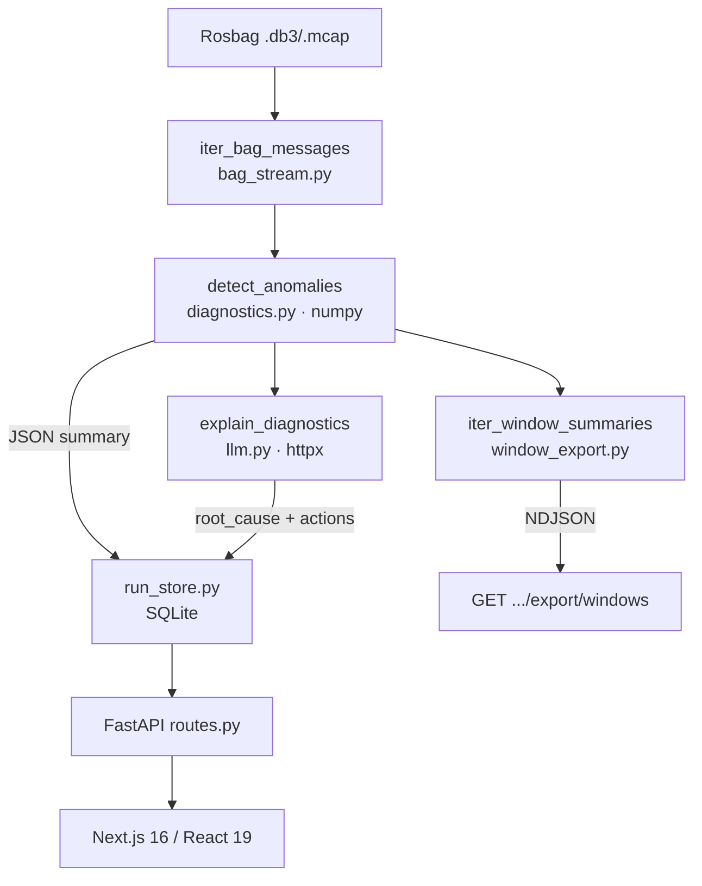

# Architecture Diagram (Concise)

## Data Flow



## Service Layers

```
Frontend (Next.js 16 / React 19 / shadcn/ui)
    │ HTTP REST
    ▼
FastAPI ─── Auth (optional token) ─── Rate Limiter (in-memory, 120 req/min)
    │
    ├── diagnostics.py    — rule engine (5 detection kinds, numpy)
    ├── window_export.py  — NDJSON summarizer (~100x compress)
    ├── llm.py            — raw httpx → OpenAI-compatible endpoint
    ├── experiments.py    — upload/delete/scan datasets
    ├── run_store.py      — SQLite persistence (runs/anomalies/ai_results/review)
    └── diagnostics_config.py — thresholds (defaults → file → runtime overrides)
    │
    ▼
Storage: SQLite (runs.db) + data/<id>/*.db3/.mcap + data/diagnostics/thresholds.json
```

## No LangGraph / ChromaDB / PostgreSQL

This system uses a straight function-call chain, not a graph; SQLite, not a vector store or RDBMS cluster. See [ARCHITECTURE.md](../ARCHITECTURE.md) for the reasoning.