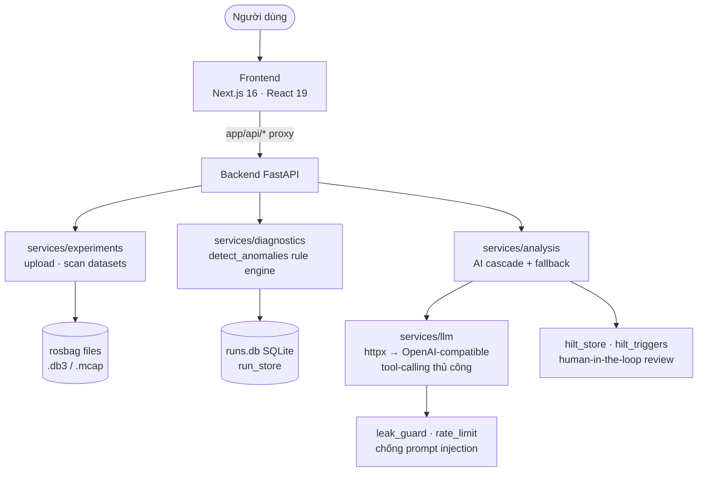

## System Architecture

RAV-13 là hệ thống phân tích rosbag: FastAPI backend chạy rule-engine chẩn đoán
trên dữ liệu bag thật, Next.js console hiển thị kết quả, LLM (OpenAI-compatible)
chỉ đóng vai trò giải thích root cause.

### Overview Diagram

## Components

### 1. Frontend (Next.js 16 App Router)

- **Purpose:** RAV Console — registry dataset, run detail (anomaly/timeline/log/AI), dashboard
- **Stack:** React 19, TypeScript, SWR, shadcn/ui, Tailwind CSS v4, Recharts
- **API proxy:** các route handler dưới `frontend/app/api/*` gọi backend, không business logic

### 2. Backend (FastAPI)

- **Purpose:** REST API + điều phối phân tích (`src/api/routes.py`)
- **Endpoints chính:** upload/delete dataset, `POST /analysis/diagnose|explain`, runs
  (timeline/logs/health/deep-dive/ai), chat, review + decision, dashboard overview
- **Auth:** Bearer token qua `API_AUTH_TOKEN` (pydantic-settings, `.env`)

### 3. Diagnostics Rule Engine (không phải LLM agent)

- `bag_stream`: đọc bag thật dạng **lazy iterator** (streaming, không load cả bag vào RAM);
  `parse_rosbag2_db3` / `parse_mcap_file`: parse toàn bộ thành list
- `detect_anomalies`: ~15 rule độc lập (frequency_gap, silent_node, clock_drift,
  hz_drop, tf_*, payload_*...) trả detections kèm evidence
- Ngưỡng mặc định + override persist tại `data/diagnostics/thresholds.json`

### 4. LLM Service (httpx thuần)

- `chat_completion` gọi endpoint OpenAI-compatible (OpenAI / vLLM / Anthropic),
  tham số `tools` làm nền cho **tool-calling thủ công — không LangChain/LangGraph**
- `analysis.py` chạy cascade giải thích từng cluster, fallback khi LLM lỗi;
  `leak_guard` + `rate_limit` bảo vệ đường LLM

### 5. Storage

- **SQLite** `data/runs.db` (run_store): runs, anomalies, reviews, HILT decisions
- **File system**: rosbag uploads dưới `data/` — mount volume persistent khi deploy

## Data Flow

1. User upload rosbag → `experiments.save_uploaded_rosbag` (zip-slip-safe), derive metadata từ bag
2. Analyze → đọc message stream lazy → `detect_anomalies` → persist vào `runs.db`
3. AI explain từng cluster anomaly (cascade + fallback), guard bởi leak_guard/rate_limit
4. Human-in-the-loop: expert review/duyệt đề xuất qua HILT routes
5. Frontend (SWR) render timeline, anomaly, AI results

## Design Decisions

| Decision | Choice | Reason |
|----------|--------|--------|
| Backend framework | FastAPI | Async, auto-docs `/docs`, type-safe với Pydantic v2 |
| Agent framework | **Không dùng** — httpx + tool-calling thủ công | Kiểm soát trọn vẹn payload/prompt, chống prompt injection, giảm dependency |
| Database | SQLite | Single-file dễ backup, đủ cho workload, mount được volume persistent |
| Frontend | Next.js App Router | Route handler làm API proxy, SSR cho console |
| Config | pydantic-settings + `.env` | Secrets không bao giờ nằm trong code |
| Deploy | GCP VM + docker compose + Terraform (`terraform/gcp`) | CI/CD tự động qua GitHub Actions |
