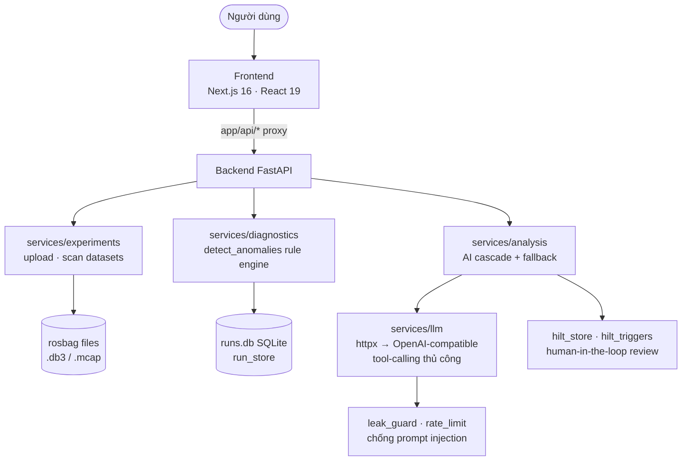

# Fix Cohort-1 Anti-Patterns Implementation Plan

> **For agentic workers:** REQUIRED SUB-SKILL: Use superpowers:subagent-driven-development (recommended) or superpowers:executing-plans to implement this plan task-by-task. Steps use checkbox (`- [ ]`) syntax for tracking.

**Goal:** Xử lý 4 vi phạm phát hiện khi audit dự án theo `docs/guide/anti-patterns/cohort-1-mistakes.md`.

**Architecture:** 1 fix nhỏ về observability (logging), 1 pure-refactor có characterization tests bảo vệ, 2 task viết lại docs cho khớp thực tế. Không đổi public API, không thêm dependency.

**Tech Stack:** Python 3.11 + pytest + ruff + mypy strict; Markdown docs tiếng Việt.

**Spec:** `docs/guide/anti-patterns/cohort-1-mistakes.md` + kết quả audit (bảng 10 mục).

## Global Constraints

- Public signature **không đổi**: `detect_anomalies(messages: Iterable[Mapping[str, Any]], thresholds: dict[str, Any] | None = None, expected_hz: Mapping[str, float] | None = None) -> dict[str, Any]`
- Sau mỗi bước refactor: `pytest tests -q` xanh; cuối task: `ruff check src tests` + `mypy src` sạch (config trong `pyproject.toml`)
- Coverage không giảm dưới 75% (`fail_under` hiện có)
- Docs giữ tiếng Việt, đúng style hiện tại
- **KHÔNG xóa** `terraform/environments/` (Azure legacy) — chỉ sửa tài liệu, GCP là nguồn sự thật
- Không đụng vào `scripts/log_*.py` (silent except trong dev tooling — ngoài scope, đã cân nhắc và bỏ qua)

---

### Task 1: Log exception bị nuốt trong `_read_bagfile_info_from_mcap`

**Files:**
- Modify: `src/services/experiments.py:257` (+ module logger sau imports ~line 24)
- Test: `tests/test_services/test_experiments.py`

**Interfaces:**
- Consumes: hàm private hiện có `_read_bagfile_info_from_mcap(folder: Path) -> dict[str, Any] | None`
- Produces: module-level `logger = logging.getLogger(__name__)`; behavior mới — khi đọc mcap fail sẽ emit warning `"Failed to derive metadata from MCAP %s: %s"`

- [ ] **Step 1: Write failing test** (append vào `tests/test_services/test_experiments.py`)

```python
def test_mcap_metadata_failure_logs_warning(tmp_path, caplog):
    bad = tmp_path / "bad.mcap"
    bad.write_bytes(b"NOT-A-REAL-MCAP-FILE")
    import logging as _logging

    from src.services import experiments

    with caplog.at_level(_logging.WARNING, logger="src.services.experiments"):
        result = experiments._read_bagfile_info_from_mcap(tmp_path)
    assert result is None
    assert any("Failed to derive metadata from MCAP" in r.message for r in caplog.records)
```

- [ ] **Step 2: Chạy verify fail** — `python -m pytest tests/test_services/test_experiments.py::test_mcap_metadata_failure_logs_warning -v` → **FAIL** ở assert caplog (hiện code nuốt exception im lặng tại `experiments.py:257`)
- [ ] **Step 3: Implement** — thêm sau imports (trước `from src.services import perf`):

```python
logger = logging.getLogger(__name__)
```

Sửa except block (line 257–258):

```python
    except Exception as exc:
        logger.warning("Failed to derive metadata from MCAP %s: %s", mcap.name, exc)
        return None
```

Và thay logger cục bộ trong `_ensure_timestamp_index` (line 284) bằng module-level `logger` (xóa dòng `logger = logging.getLogger(__name__)` nội hàm).

- [ ] **Step 4: Chạy verify pass** — test mới PASS + `python -m pytest tests/test_services/test_experiments.py -q` toàn xanh
- [ ] **Step 5: Commit**

```bash
git add src/services/experiments.py tests/test_services/test_experiments.py
git commit -m "fix(experiments): log mcap metadata failures instead of returning None silently"
```

---

### Task 2: Refactor `detect_anomalies` (309 dòng → orchestration ~65 dòng)

**Files:**
- Modify: `src/services/diagnostics.py:1349-1657` (chỉ vùng này + imports đầu file)
- Test (đã có, không sửa): `tests/test_services/test_diagnostics.py` — 72 test characterization

**Interfaces:**
- Produces (helpers private, đặt ngay trước `detect_anomalies`, sau `_evaluate_auxiliary_rules`):
  - `_StreamAggregates` (dataclass)
  - `_collect_stream_aggregates(messages: Iterable[Mapping[str, Any]]) -> _StreamAggregates`
  - `_resolve_cadence_topics(topic_message_types: Mapping[str, set[str]], expected_hz: Mapping[str, float] | None) -> set[str]`
  - `_empty_input_result(resolved_thresholds: dict[str, Any]) -> dict[str, Any]`
  - `_apply_pre_roll_grace(detections: list[dict[str, Any]], topic_times: Mapping[str, list[float]], grace_sec: float) -> list[dict[str, Any]]`
  - `_finalize_detections(detections: list[dict[str, Any]], topic_times: Mapping[str, list[float]]) -> float`
- Consumes: các `_evaluate_*` đã tồn tại — không đổi
- Rationale scope: guide đánh dấu vi phạm ở mức "200+ lines/function"; chỉ `detect_anomalies` (309) vượt ngưỡng. `chat_completion` (122) và `_evaluate_hz_drop_rules` (102) là cohesive rule/IO functions — theo dõi, không ép tách trong task này.

- [ ] **Step 1: Baseline xanh** — `python -m pytest tests/test_services/test_diagnostics.py -q` → ghi nhận số test pass (72)
- [ ] **Step 2: Thêm import** `from dataclasses import dataclass, field` vào đầu `diagnostics.py` (nếu chưa có)
- [ ] **Step 3: Extract `_StreamAggregates` + `_collect_stream_aggregates`** — di chuyển nguyên khối khởi tạo aggregates (line 1444–1453) và vòng lặp ingestion (line 1454–1507) vào:

```python
@dataclass
class _StreamAggregates:
    """Per-stream aggregates accumulated by the single ingestion pass."""

    topic_times: dict[str, list[float]] = field(default_factory=dict)
    topic_message_types: dict[str, set[str]] = field(default_factory=dict)
    topic_node_counts: dict[str, dict[str, int]] = field(default_factory=dict)
    topic_latency: dict[str, list[tuple[float, float]]] = field(default_factory=dict)
    topic_payload: dict[str, list[tuple[float, int]]] = field(default_factory=dict)
    topic_nan: dict[str, list[tuple[float, float]]] = field(default_factory=dict)
    topic_out_of_range: dict[str, list[tuple[float, float]]] = field(default_factory=dict)
    log_entries: dict[str, list[tuple[float, str]]] = field(default_factory=dict)
    tf_pairs: dict[
        str, list[tuple[float, str, str, tuple[float, float, float] | None]]
    ] = field(default_factory=dict)
    total_messages: int = 0


def _collect_stream_aggregates(messages: Iterable[Mapping[str, Any]]) -> _StreamAggregates:
    """Consume ``messages`` exactly once, bucketing fields per rule family."""
    agg = _StreamAggregates()
    for message in messages:
        # ... (di chuyển nguyên thân vòng lặp 1454–1507, thay tên biến
        #      topic_times -> agg.topic_times ... tổng Messages += 1 -> agg.total_messages += 1,
        #      giữ nguyên debug-log 'diagnostics.message_skipped')
    return agg
```

- [ ] **Step 4: Verify** — `python -m pytest tests/test_services/test_diagnostics.py -q` xanh
- [ ] **Step 5: Extract 4 helper còn lại** với nội dung copy y nguyên từ body (giữ comment gốc):

```python
def _resolve_cadence_topics(
    topic_message_types: Mapping[str, set[str]],
    expected_hz: Mapping[str, float] | None,
) -> set[str]:
    # Status/event messages have no stable publish cadence unless a caller
    # supplies an explicit expected rate. Treating their natural pauses as
    # failures produced false Gate 2 alarms on healthy captures.
    return {
        topic
        for topic, message_types in topic_message_types.items()
        if (expected_hz is not None and topic in expected_hz)
        or not message_types.intersection(_EVENT_DRIVEN_MESSAGE_TYPES)
    }


def _empty_input_result(resolved_thresholds: dict[str, Any]) -> dict[str, Any]:
    empty_log_payload: dict[str, Any] = {
        "event": "diagnostics.analysis.empty_input",
        "level": "info",
        "message": "No messages available for diagnostics.",
        "details": {"message_count": 0, "thresholds": resolved_thresholds},
    }
    logger.info("diagnostics.analysis.empty_input", extra={"diagnostics": empty_log_payload})
    return {
        "summary": {"total_messages": 0, "total_detections": 0, "severity": "low"},
        "detections": [],
        "thresholds": resolved_thresholds,
        "logs": [empty_log_payload],
    }


def _apply_pre_roll_grace(
    detections: list[dict[str, Any]],
    topic_times: Mapping[str, list[float]],
    grace_sec: float,
) -> list[dict[str, Any]]:
    # Recorder/simulator warm-up produces irregular publish timing for the
    # first few seconds of every topic's own life, independent of any real
    # fault; without a filter these look identical to a genuine anomaly. No
    # injected fault in the framework's dataset starts inside the observed
    # warm-up window (worst case ~6.3s), so excluding each topic's own first
    # `pre_roll_grace_sec` never masks a real incident.
    if grace_sec <= 0:
        return detections
    topic_start = {topic: min(timestamps) for topic, timestamps in topic_times.items()}
    return [
        d
        for d in detections
        if float(d.get("tSec", 0.0))
        >= topic_start.get(str(d.get("topic", "")), float("-inf")) + grace_sec
    ]


def _finalize_detections(
    detections: list[dict[str, Any]],
    topic_times: Mapping[str, list[float]],
) -> float:
    """Sort, assign stable ids, and stamp relative times. Returns stream start."""
    # Identity is assigned here, at the point detections are created, so it
    # survives into the anomaly store and every consumer downstream refers to
    # the same anomaly by the same name. Without it the HILT routes matched on
    # an `id` key that raw detections never carried and always 404'd.
    # Detection timestamps are absolute simulation time, which on its own says
    # nothing about where in the recording an event sits — a fault at t=1815 in
    # a 182-second bag reads as implausible until you know the bag starts at
    # 1761, and anything plotting it against recording duration draws it off the
    # end of the timeline. Publish the observed bounds, and carry the relative
    # time on each detection so consumers never have to guess the origin.
    all_times = [t for times in topic_times.values() for t in times]
    stream_start = min(all_times) if all_times else 0.0
    detections.sort(
        key=lambda d: (float(d.get("tSec", 0.0)), str(d.get("topic", "")), str(d.get("kind", "")))
    )
    for index, detection in enumerate(detections, start=1):
        detection["id"] = f"anomaly_{index:03d}"
        detection["tRelSec"] = round(float(detection.get("tSec", 0.0)) - stream_start, 3)
        detection["endRelSec"] = round(
            float(detection.get("endSec", detection.get("tSec", 0.0))) - stream_start, 3
        )
    return stream_start
```

- [ ] **Step 6: Viết lại thân `detect_anomalies`** thành pipeline (giữ nguyên docstring 1354–1440):

```python
    resolved_thresholds = merge_diagnostics_thresholds(thresholds=thresholds)
    logs: list[dict[str, Any]] = []
    agg = _collect_stream_aggregates(messages)

    if agg.total_messages == 0:
        return _empty_input_result(resolved_thresholds)

    cadence_topics = _resolve_cadence_topics(agg.topic_message_types, expected_hz)
    detections: list[dict[str, Any]] = []

    for topic, timestamps in agg.topic_times.items():
        if topic not in cadence_topics:
            continue
        timestamps_arr = sorted(timestamps)
        if len(timestamps_arr) < 2:
            continue
        topic_detections, topic_logs = _evaluate_topic_rules(topic, timestamps_arr, resolved_thresholds)
        detections.extend(topic_detections)
        logs.extend(topic_logs)

    clock_drift_windows: dict[str, list[tuple[float, float]]] = defaultdict(list)
    for topic, samples in agg.topic_latency.items():
        drift_detections, drift_log, drift_windows = _evaluate_drift_rule(
            topic, sorted(samples), resolved_thresholds
        )
        detections.extend(drift_detections)
        logs.append(drift_log)
        if drift_windows:
            clock_drift_windows[topic].extend(drift_windows)

    observation_end = max(t for times in agg.topic_times.values() for t in times)
    for topic, timestamps in agg.topic_times.items():
        if topic not in cadence_topics:
            continue
        timestamps_arr = sorted(timestamps)
        if len(timestamps_arr) < 2:
            continue
        node_counts = agg.topic_node_counts[topic]
        node = max(node_counts, key=lambda value: node_counts[value])
        silent_detections, silent_log = _evaluate_silent_rule(
            topic, node, timestamps_arr, observation_end, resolved_thresholds
        )
        detections.extend(silent_detections)
        logs.append(silent_log)

    aux_detections, aux_logs = _evaluate_auxiliary_rules(
        agg.topic_times, agg.topic_latency, agg.log_entries, agg.topic_payload,
        agg.topic_nan, agg.topic_out_of_range, agg.tf_pairs, resolved_thresholds,
        expected_hz, cadence_topics, observation_end, clock_drift_windows,
    )
    detections.extend(aux_detections)
    logs.extend(aux_logs)

    detections = _apply_pre_roll_grace(
        detections, agg.topic_times, float(resolved_thresholds["pre_roll_grace_sec"])
    )
    stream_start = _finalize_detections(detections, agg.topic_times)

    result = {
        "summary": {
            "total_messages": agg.total_messages,
            "total_detections": len(detections),
            "severity": "medium" if detections else "low",
            "stream_start_sec": stream_start,
            "stream_end_sec": max(
                t for times in agg.topic_times.values() for t in times
            ) if agg.topic_times else 0.0,
        },
        "detections": detections,
        "thresholds": resolved_thresholds,
        "logs": logs,
    }
    logger.info(
        "diagnostics.analysis.completed",
        extra={
            "diagnostics": {
                "event": "diagnostics.analysis.completed",
                "level": "info",
                "message": "Diagnostics analysis completed.",
                "details": {
                    "total_messages": agg.total_messages,
                    "total_detections": len(detections),
                    "thresholds": resolved_thresholds,
                },
            }
        },
    )
    return result
```

⚠️ Behavioral notes bắt buộc giữ đúng: (1) `_evaluate_topic_rules` nhận `timestamps_arr = sorted(...)` như cũ; (2) empty-input phải xảy ra **trước** khi tính `cadence_topics`; (3) thứ tự rule: topic → drift → silent → auxiliary → pre-roll → finalize (id phụ thuộc sort cuối).
- [ ] **Step 7: Verify đầy đủ** — lần lượt:
  - `python -m pytest tests/test_services/test_diagnostics.py -q` (72 pass, đúng baseline)
  - `python -m pytest tests -q` (toàn bộ xanh, coverage ≥75%)
  - `ruff check src tests` sạch · `mypy src` sạch
- [ ] **Step 8: Commit**

```bash
git add src/services/diagnostics.py
git commit -m "refactor(diagnostics): split detect_anomalies into focused helpers"
```

---

### Task 3: Viết lại `system-design.md` theo kiến trúc thật

**Files:**
- Modify: `docs/guide/architecture/system-design.md` (thay toàn bộ phần sau frontmatter)

**Interfaces:** không có — docs-only. Nội dung phải khớp code: README line 21 ("không dùng LangGraph/LangChain"), `src/config.py` (SQLite, httpx, multi-provider), danh sách services thật, `gcp-deploy.yml`.

- [ ] **Step 1: Replace toàn bộ nội dung** (giữ frontmatter, cập nhật title/description) bằng:

```markdown
## System Architecture

RAV-13 là hệ thống phân tích rosbag: FastAPI backend chạy rule-engine chẩn đoán
trên dữ liệu bag thật, Next.js console hiển thị kết quả, LLM (OpenAI-compatible)
chỉ đóng vai trò giải thích root cause.

### Overview Diagram



## Components

### 1. Frontend (Next.js 16 App Router)

- **Purpose:** RAV Console — registry dataset, run detail (anomaly/timeline/log/AI), dashboard
- **Stack:** React 19, TypeScript, SWR, shadcn/ui, Tailwind CSS v4, Recharts
- **API proxy:** các route handler dưới `frontend/app/api/*` gọi backend, không business logic

### 2. Backend (FastAPI)

- **Purpose:** REST API + điều phối phân tích (`src/api/routes.py`)
- **Endpoints chính:** upload/delete dataset, `POST /analysis/diagnose|explain`, runs
  (timeline/logs/health/deep-dive/ai), chat, review + decision, dashboard overview
- **Auth:** Bearer token qua `API_AUTH_TOKEN` (pydantic-settings, `.env`)

### 3. Diagnostics Rule Engine (không phải LLM agent)

- `bag_stream` / `parse_rosbag2_db3` / `parse_mcap_file`: đọc bag thật (lazy iterator)
- `detect_anomalies`: ~15 rule độc lập (frequency_gap, silent_node, clock_drift,
  hz_drop, tf_*, payload_*...) trả detections kèm evidence
- Ngưỡng mặc định + override persist tại `data/diagnostics/thresholds.json`

### 4. LLM Service (httpx thuần)

- `chat_completion` gọi endpoint OpenAI-compatible (OpenAI / vLLM / Anthropic),
  tham số `tools` làm nền cho **tool-calling thủ công — không LangChain/LangGraph**
- `analysis.py` chạy cascade giải thích từng cluster, fallback khi LLM lỗi;
  `leak_guard` + `rate_limit` bảo vệ đường LLM

### 5. Storage

- **SQLite** `data/runs.db` (run_store): runs, anomalies, reviews, HILT decisions
- **File system**: rosbag uploads dưới `data/` — mount volume persistent khi deploy

## Data Flow

1. User upload rosbag → `experiments.save_uploaded_rosbag` (zip-slip-safe), derive metadata từ bag
2. Analyze → đọc message stream lazy → `detect_anomalies` → persist vào `runs.db`
3. AI explain từng cluster anomaly (cascade + fallback), guard bởi leak_guard/rate_limit
4. Human-in-the-loop: expert review/duyệt đề xuất qua HILT routes
5. Frontend (SWR) render timeline, anomaly, AI results

## Design Decisions

| Decision | Choice | Reason |
|----------|--------|--------|
| Backend framework | FastAPI | Async, auto-docs `/docs`, type-safe với Pydantic v2 |
| Agent framework | **Không dùng** — httpx + tool-calling thủ công | Kiểm soát trọn vẹn payload/prompt, chống prompt injection, giảm dependency |
| Database | SQLite | Single-file dễ backup, đủ cho workload, mount được volume persistent |
| Frontend | Next.js App Router | Route handler làm API proxy, SSR cho console |
| Config | pydantic-settings + `.env` | Secrets không bao giờ nằm trong code |
| Deploy | GCP VM + docker compose + Terraform (`terraform/gcp`) | CI/CD tự động qua GitHub Actions |
```

- [ ] **Step 2: Self-check** — mọi component nêu trong doc phải tồn tại trong `src/services/` (đối chiếu tên file); không còn chữ "LangGraph"/"ChromaDB"/"PostgreSQL"/"Zustand"
- [ ] **Step 3: Commit**

```bash
git add docs/guide/architecture/system-design.md
git commit -m "docs(architecture): rewrite system design to match actual implementation"
```

---

### Task 4: Sửa README — bỏ drift Azure, phản ánh CI/CD GCP thật

**Files:**
- Modify: `README.md` (4 vùng: bảng tech stack ~line 53-54; cây cấu trúc ~line 73-89; mục Deployment ~line 94-241; giữ nguyên phần còn lại)

**Interfaces:** docs-only; nguồn sự thật = `.github/workflows/{ci,gcp-deploy,gitleaks,trivy,codeql,docker-security}.yml`, `terraform/gcp/`, `docker-compose.gcp.yml`.

- [ ] **Step 1: Sửa bảng Tech Stack** — 2 dòng:

```markdown
| Infrastructure | Terraform (`terraform/gcp`: GCP Compute Engine VM, Artifact Registry, GCS tfstate) |
| CI/CD | GitHub Actions: `gitleaks.yml`, `trivy.yml`, `codeql.yml` → `ci.yml` → `gcp-deploy.yml` |
```

- [ ] **Step 2: Sửa cây cấu trúc** — thay các entry terraform/env/nginx/workflows bằng:

```
├── terraform/gcp/                 # Infrastructure as Code (Google Provider)
│   ├── main.tf                    # Compute Engine VM, static IP, firewall, IAM, Artifact Registry
│   ├── environments/              # staging.tfvars & production.tfvars
│   └── templates/                 # Cloud-init / startup script cho VM
├── env/                           # Mẫu .env biệt lập môi trường
│   ├── staging.env.example
│   └── production.env.example
├── nginx/                         # Reverse proxy (gcp-nginx.conf) & SSL/TLS
├── docker-compose.gcp.yml         # Stack production trên VM (backend + frontend + nginx)
├── scripts/gcp/                   # deploy.sh — pull image & up stack trên VM
├── .github/workflows/
│   ├── ci.yml                     # Tests: backend (ruff + pytest cov≥75%), frontend (lint + unit), Playwright E2E
│   ├── gcp-deploy.yml             # CD: develop→staging VM, main→production VM (qua IAP tunnel)
│   └── gitleaks.yml / trivy.yml / codeql.yml / docker-security.yml  # Security scans
```

- [ ] **Step 3: Thay mục "🚀 Deployment & CI/CD Guide (Microsoft Azure)"** bằng mục `🚀 Deployment & CI/CD Guide (Google Cloud Platform)`:

```markdown
### 🌐 1. Kiến Trúc Deployment GCP

Hệ thống triển khai lên **GCP Compute Engine VM** với 2 môi trường (**staging**
từ nhánh `develop`, **production** từ nhánh `main`):

```mermaid
graph TD
    DEV[Developer] --> SEC[Security Scans: Gitleaks · Trivy · CodeQL]
    SEC --> CI[CI: ci.yml<br/>pytest cov≥75% · pnpm lint/test · Playwright E2E]
    DEV --> MERGE[Merge: develop / main]
    MERGE --> CD[gcp-deploy.yml]
    CD --> AUTH[Workload Identity Federation]
    AUTH --> TF[Terraform Apply: terraform/gcp<br/>VM · IP tĩnh · Artifact Registry]
    TF --> IMG[Build & Push images:<br/>backend:{sha} · frontend:{sha}]
    IMG --> SCP[SCP .env + compose + nginx + deploy.sh<br/>qua IAP tunnel]
    SCP --> VMSTG[VM ai20k-p077-staging · e2-small]
    IMG --> VMPROD[VM ai20k-p077-production · e2-medium]
    VMSTG --> HC[Health Gate: curl http://IP/health]
    VMPROD --> HC
```

#### Ánh Xạ Dịch Vụ Hạ Tầng:
- **Compute**: GCP Compute Engine (`e2-small` staging / `e2-medium` production), zone `asia-southeast1-a`
- **Registry**: Artifact Registry — `{region}-docker.pkg.dev/ai20k-p077/backend|frontend`, tag theo `github.sha` + `latest`
- **IaC state**: GCS bucket `tfstate-ai20k-p077-gcp`
- **Truy cập VM**: SSH qua **IAP tunnel**, không public port quản trị
- **Reverse proxy**: nginx (SSL/TLS termination), stack chạy bằng `docker-compose.gcp.yml`

### 💻 2. Cách Chạy Local

*(giữ nguyên Option A: Uvicorn + Node, và Option B: Docker Compose như hiện tại)*

### 🔄 3. Quy Trình Deploy Tự Động

1. PR vào `develop` → security scans + CI chạy trên PR
2. Merge vào `develop` → `gcp-deploy.yml` deploy **staging** (branch gate)
3. Merge `develop` → `main` → deploy **production**
4. Chạy tay: tab Actions → *CD - GCP Deployment* → **Run workflow** (workflow_dispatch)

### ⏪ 4. Rollback Trên GCP

Image lưu theo từng `github.sha` trong Artifact Registry, nên rollback = deploy lại commit cũ:
- **Cách 1**: Actions → *CD - GCP Deployment* → Run workflow tại ref = commit ổn định trước đó
- **Cách 2**: SSH qua IAP rồi chạy `sudo bash /opt/app/deploy.sh <old_backend_image> <old_frontend_image>`

### 🔑 5. Biến Môi Trường

| Nhóm | Biến | Nguồn |
|---|---|---|
| App | `APP_ENV` (do CD set), `APP_PORT`, `LOG_LEVEL`, `CORS_ORIGINS` | `.env` trên VM (từ secret `GCP_DOTENV`) |
| Bảo mật | `API_AUTH_TOKEN` | GitHub Secret → `.env` VM |
| LLM | `OPENAI_API_KEY` (hoặc `VLLM_BASE_URL`/`ANTHROPIC_API_KEY`) | GitHub Secret → `.env` VM |
| CI/CD | `GCP_REGION`, `GCP_WORKLOAD_IDENTITY_PROVIDER`, `GCP_SERVICE_ACCOUNT`, `GCP_DOTENV` | GitHub Secrets |
```

- [ ] **Step 4: Verify không còn drift** —

```powershell
Select-String -Path README.md -Pattern "Azure|azurecr|staging\.yml|production\.yml|containerapp|az login"
```
→ kỳ vọng **0 match**. Kiểm tra link nội bộ vẫn hợp lệ (`docs/benchmark.md` tồn tại).
- [ ] **Step 5: Commit**

```bash
git add README.md
git commit -m "docs(readme): align deployment guide with actual GCP CI/CD pipeline"
```

---

## Self-Review (đã chạy lúc viết plan)

1. **Spec coverage**: 4 finding → Task 1 (silent except), Task 2 (hàm dài), Task 3 (system-design sai lệch), Task 4 (README drift) ✓. Các cảnh báo phụ (`chat_completion` 122 dòng, `db3` catch specific-but-silent, scripts dev-tooling) được ghi rõ **ngoài scope** có chủ đích.
2. **Placeholder scan**: mọi code step có nội dung thật.
3. **Type consistency**: helper signatures khớp 100% cách dùng trong Step 5–6.
